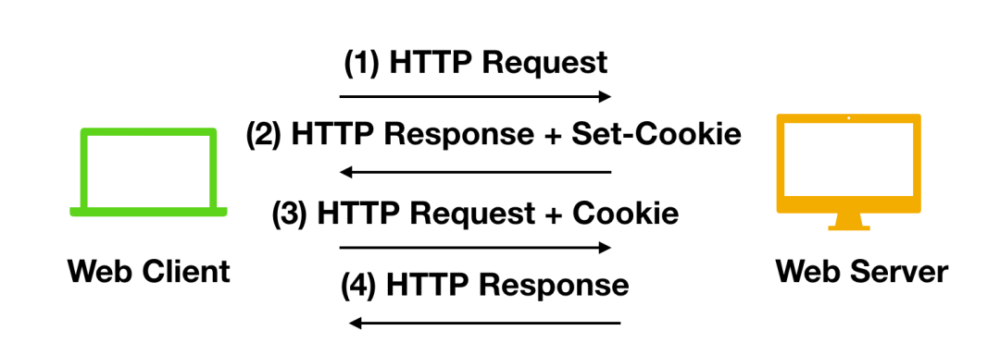

## [Cookie](http://www.justdojava.com/2019/07/01/java-JAVAWebKnowledge/)

- 在Web应用中，HTTP请求是无状态的。也就是说用户第一次发起请求，与服务器建立连接并登录成功后，为了避免每次打开一个页面都需要登录一下，就出现了Cookie，Session。
- 服务器单从网络连接上无从知道客户身份。怎么办呢？就给客户端们颁发一个通行证吧，每人一个，无论谁访问都必须携带自己通行证。这样服务器就能从通行证上确认客户身份了。这就是Cookie的工作原理。
- Cookie是客户端保存用户信息的一种机制，用来记录用户的一些信息
- 当接收到客户端发出的 HTTP 请求时，服务器可以发送带有响应的 `Set-Cookie` 标头，Cookie 通常由浏览器存储，然后将 Cookie 与 HTTP 标头一同向服务器发出请求。



### Session

- 客户端请求服务端，服务端会为这次请求开辟一块内存空间，这个对象便是 Session 对象，存储结构为 `ConcurrentHashMap`，可存储客户的数据，记录客户端状态
- Session 弥补了 HTTP 无状态特性，服务器可以利用 Session 存储客户端在同一个会话期间的一些操作记录
- Session的实现是基于Cookie，Session需要借助于Cookie存储客户的唯一性标识JSESSIONID，客户端需要每次都携带该ID去服务器中寻找属于自己的内存空间

#### 获取Session对象

`HttpSession session = request.getSession();`   

此方法会获得专属于当前会话的Session对象

- 如果服务器端没有该会话的Session对象会创建一个新的Session返回
- 如果已经有了属于该会话的Session直接将已有的Session返回
- 实质就是根据JSESSIONID判断该客户端是否在服务器上已经存在Session

#### 向Session中存取数据

```java
session.setAttribute(String name,Object obj);
session.getAttribute(String name);
session.removeAttribute(String name);
```

#### Session对象的生命周期

- 创建：第一次执行`request.getSession()`时创建

- 销毁： 

  1）服务器（非正常）关闭时

  2）session过期/失效（默认30分钟，从不操作服务器端的资源开始计时）,可以在工程的web.xml中进行配置

  ```xml
  <session-config>
  	<session-timeout>30</session-timeout>
  </session-config>
  ```

  3）手动销毁session `session.invalidate();`

- 浏览器关闭，session就销毁了？ 不对。

  Session生成后，只要用户继续访问，服务器就会更新Session的最后访问时间，并维护该Session。为防止内存溢出，服务器会把长时间内没有活跃的Session从内存删除。

## Token

- token的意思是“令牌”，是服务端生成的一串字符串，作为客户端进行请求的一个标识。
- 当用户第一次登录后，服务器生成一个token并将此token返回给客户端，以后客户端只需带上这个token前来请求数据即可，无需再次带上用户名和密码。在不同页面之间切换时，保存用户登录信息的机制
- 简单token的组成；uid(用户唯一的身份标识)、time(当前时间的时间戳)、sign（签名，token的前几位以哈希算法压缩成的一定长度的十六进制字符串。为防止token泄露）。

### 作用

- 防止表单重复提交
- 身份验证，一般情况下用在APP中

### 其他

- 为了避免查询时间过长，可以将token放到内存中
- 可以将请求URL、时间戳、token三者合并，通过算法进行加密处理
- 在网络层面上Token使用明文传输的话是非常危险的，所以一定要使用HTTPS协议

## 参考

- [cxuan Java建设者](https://mp.weixin.qq.com/s?__biz=MzU2NDg0OTgyMA==&mid=2247486128&idx=1&sn=22452c66ce760a9290a9eac9c27f64f4&chksm=fc45f743cb327e55f9337c04e9975615e221c209aaa0dc2f48c68f9a08c209c5c5e082fa21e8&mpshare=1&scene=1&srcid=&sharer_sharetime=1589011015945&sharer_shareid=0371ca963acf0af2ddb31b55f8b68241#rd)
- [后端JAVAWeb工程师必须掌握的三个内容](http://www.justdojava.com/2019/07/01/java-JAVAWebKnowledge/)
- [看完这篇 Session、Cookie、Token，和面试官扯皮就没问题了](https://mp.weixin.qq.com/s?__biz=MzU2NDg0OTgyMA==&mid=2247486128&idx=1&sn=22452c66ce760a9290a9eac9c27f64f4&chksm=fc45f743cb327e55f9337c04e9975615e221c209aaa0dc2f48c68f9a08c209c5c5e082fa21e8&mpshare=1&scene=1&srcid=&sharer_sharetime=1589011015945&sharer_shareid=0371ca963acf0af2ddb31b55f8b68241#rd)
- 
