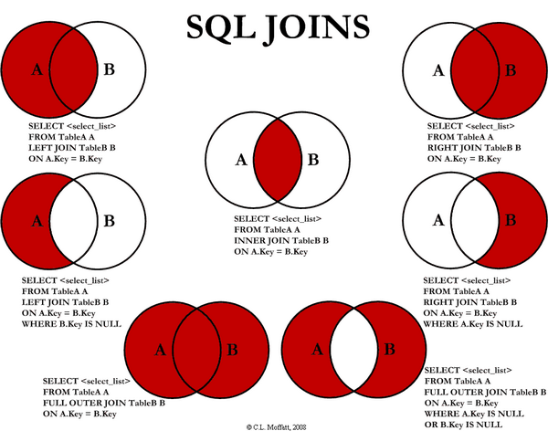

# 数据库

## 数据库基础

### 事务的概念和特性？

#### 概念

- 事务（Transaction）是一个操作序列，不可分割的工作单位，以 BEGIN TRANSACTION 开始，以 ROLLBACK/COMMIT 结束

- 把多条语句作为一个整体进行操作的功能，被称为数据库事务。数据库事务可以确保该事务范围内的所有操作都可以全部成功或者全部失败。如果事务失败，那么效果就和没有执行这些SQL一样，不会对数据库数据有任何改动。

#### 特性（ACID）

- **原子性**（Atomicity）：逻辑上是不可分割的操作单元，事务的所有操作要么全部提交成功，要么全部失败回滚（用回滚日志实现，反向执行日志中的操作）；
- **一致性**（Consistency）：事务的执行必须使数据库保持一致性状态。在一致性状态下，所有事务对一个数据的读取结果都是相同的；
- **隔离性**（Isolation）：一个事务所做的修改在最终提交以前，对其它事务是不可见的（并发执行的事务之间不能相互影响）；
- **持久性**（Durability）：一旦事务提交成功，对数据的修改是永久性的，修改被持久化存储。

### 并发一致性问题

- **丢失修改**：一个事务对数据进行了修改，在事务提交之前，另一个事务对同一个数据进行了修改，覆盖了之前的修改；
- **脏读**（Dirty Read）：一个事务读取了被另一个事务修改、但未提交（进行了回滚）的数据，造成两个事务得到的数据不一致；
- **不可重复读**（Nonrepeatable Read）：在同一个事务中，某查询操作在一个时间读取某一行数据和之后一个时间读取该行数据，发现数据已经发生修改（可能被更新了）；
- **幻读**（Phantom Read）：当同一查询多次执行时，由于其它事务在这个数据范围内执行了**插入操作**，会导致每次返回不同的结果集（和不可重复读的区别：针对的是一个数据整体/范围；并且需要是插入、删除操作）

### 数据库的四种隔离级别？

- **未提交读**（Read Uncommited）：在一个事务提交之前，它的执行结果对其它事务也是可见的。会导致脏读、不可重复读、幻读；
- **提交读**（Read Commited）：一个事务只能看见已经提交的事务所作的改变。可避免脏读问题；
- **可重复读**（Repeatable Read）：可以确保同一个事务在多次读取同样的数据时得到相同的结果。（MySQL的默认隔离级别）。可避免不可重复读；
- **可串行化**（Serializable）：强制事务串行执行，使之不可能相互冲突，从而解决幻读问题。可能导致大量的超时现象和锁竞争，实际很少使用。

### 什么是乐观锁和悲观锁？

- 悲观锁：认为数据随时会被修改，因此每次读取数据之前都会上锁，防止其它事务读取或修改数据；应用于**数据更新比较频繁**的场景；
- 乐观锁：操作数据时不会上锁，但是更新时会判断在此期间有没有别的事务更新这个数据，若被更新过，则失败重试；适用于**读多写少**的场景。
- 乐观锁的实现方式有：
  - 加一个版本号或者时间戳字段，每次数据更新时同时更新这个字段；
  - 先读取想要更新的字段或者所有字段，更新的时候比较一下，只有字段没有变化才进行更新

### 数据库的范式

- **第一范式**（1NF，Normal Form）：**属性不可分**。举例：如果将“电话”作为一个属性（一列），是不符合1NF的，因为电话这个属性可以分解为家庭电话和移动电话...如果将“移动电话”作为一个属性，就符合1NF；
- **第二范式** 2NF：每个非主属性**完全依赖**于主属性集（候选键集）；
  - B完全依赖于A，就是说A中的所有属性唯一决定B，属性少了就不能唯一决定，属性多了则有冗余（叫依赖不叫完全依赖）。举例：（学号，课程名）这个主属性集可以唯一决定成绩，但是对于学生姓名这个属性，（学号，课程名）这个属性集就是冗余的，所以学生姓名不完全依赖于（学号，课程名）这一属性集，学生姓名完全依赖于（学号）；
  - 主属性集/候选码集：某一组属性能够唯一确定其它的属性（主键就是从候选键集中选的一个键），而其子集不能，这样的属性组中的属性就是主属性；不在候选码集中的属性成为非主属性；
  - 可以通过分解来满足 2NF：将（学号，课程名，成绩）做成一张表；（学号，学生姓名）做成另一张表，避免大量的数据冗余；
    满足1NF后，要求表中的所有列，都必须依赖于主键，而不能有任何一列与主键没有关系，也就是说一个表只描述一件事情；
- **第三范式** 3NF：在 2NF 的基础上，非主属性**不传递依赖**于主属性
  - 传递依赖：如果C依赖于B，B依赖于A，那么C传递依赖于A；
  - 3NF在2NF的基础上，消除了非主属性之间的依赖；比如一个表中，主属性有（学号），非主属性有（姓名，院系，院长名），可以看到院长名这个非主属性依赖于院系，传递依赖于学号。消除的办法是分解。
    必须先满足第二范式（2NF），要求：表中的每一列只与主键直接相关而不是间接相关，（表中的每一列只能依赖于主键）；

- 不符合范式会出现哪些异常？

    - 冗余数据：某些同样的数据多次出现（如学生姓名）；
    - 修改异常：修改了一个记录中的信息，另一个记录中相同的信息却没有修改；
    - 删除异常：删除一个信息，那么也会丢失其它信息（删除一个课程，丢失了一个学生的信息）；
    - 插入异常：无法插入（插入一个还没有课程信息的学生）

### Drop/Delete/Truncate的区别？

- **Delete**用来删除表的全部或者**部分数据**，执行delete之后，用户**需要提交**之后才会执行，会触发表上的DELETE**触发器**（包含一个OLD的虚拟表，可以只读访问被删除的数据），DELETE之后表结构还在，删除很慢，一行一行地删，因为会记录日志，可以利用日志还原数据；

- **Truncate**删除表中的所有数据，这个操作**不能回滚**，也不会触发这个表上的触发器。操作比DELETE快很多（直接把表drop掉，再创建一个新表，删除的数据不能找回）。如果表中有自增（AUTO_INCREMENT）列，则重置为1；

- **Drop**命令从数据库中**删除表**，所有的数据行，索引和约束都会被删除；不能回滚，不会触发触发器；

- 什么是触发器？

  触发器（TRIGGER）是由事件（比如INSERT/UPDATE/DELETE）来触发运行的操作（不能被直接调用，不能接收参数）。在数据库里以独立的对象存储，用于**保证数据完整性**（比如可以检验或转换数据）。

- 有哪些约束类型？

  约束（Constraint）类型：主键（Primary Key）约束，唯一约束（Unique），检查约束，非空约束，外键（Foreign Key）约束。

### 关系型数据库和非关系型数据库的区别？

**非关系型数据库的优势：**

- **性能：**NOSQL是基于键值对的，可以想象成表中的主键和值的对应关系，而且不需要经过SQL层的解析，所以性能非常高。
- **可扩展性：**同样也是因为基于键值对，数据之间没有耦合性，所以非常容易水平扩展。

**关系型数据库的优势：**

- **复杂查询：**可以用SQL语句方便的在一个表以及多个表之间做非常复杂的数据查询。
- **事务支持：**使得对于安全性能很高的数据访问要求得以实现。

### 主从复制

主从复制（Replication）是指数据可以从一个MySQL数据库主服务器复制到一个或多个从服务器，从服务器可以复制主服务器中的所有数据库或者特定的数据库，或者特定的表。默认采用异步模式。

#### 实现原理

- 主服务器 **binary log dump 线程**：将主服务器中的数据更改（增删改）日志写入 Binary log 中；
- 从服务器 **I/O 线程**：负责从主服务器读取binary log，并写入本地的 Relay log；
- 从服务器 **SQL 线程**：负责读取 Relay log，解析出主服务器已经执行的数据更改，并在从服务器中重新执行（Replay），保证主从数据的一致性

#### 为什么要主从复制？

- 读写分离：主服务器负责写，从服务器负责读
  - 缓解了锁的争用，即使主服务器中加了锁，依然可以进行读操作；
  - 从服务器可以使用 MyISAM，提升查询性能以及节约系统开销；
  - 增加冗余，提高可用性
- 数据实时备份，当系统中某个节点发生故障时，可以方便的故障切换
- 降低单个服务器磁盘I/O访问的频率，提高单个机器的I/O性能

### MySQL的两种存储引擎 InnoDB 和 MyISAM 的区别

- InnoDB**支持事务**，可以进行Commit和Rollback；
- MyISAM 只支持表级锁，而 InnoDB 还**支持行级锁**，提高了并发操作的性能；
- InnoDB **支持外键**；
- MyISAM **崩溃**后发生损坏的概率比 InnoDB 高很多，而且**恢复的速度**也更慢；
- MyISAM 支持**压缩**表和空间数据索引，InnoDB需要更多的内存和存储；
- InnoDB 支持在线**热备份**
- MyISAM：如果应用程序通常以检索为主，只有少量的插入、更新和删除操作，并且对事物的完整性、并发程度不是很高的话，通常建议选择 MyISAM 存储引擎。
- InnoDB：如果使用到外键、需要并发程度较高，数据一致性要求较高，那么通常选择 InnoDB 引擎，一般互联网大厂对并发和数据完整性要求较高，所以一般都使用 InnoDB 存储引擎。

#### 应用场景

- **MyISAM** 管理非事务表。它提供高速存储和检索（MyISAM强调的是性能，每次查询具有原子性，其执行速度比InnoDB更快），以及全文搜索能力。如果表比较小，或者是只读数据（有大量的SELECT），还是可以使用MyISAM；
- **InnoDB** 支持事务，并发情况下有很好的性能，基本可以替代MyISAM

#### 热备份和冷备份

- 热备份：在数据库运行的情况下备份的方法。优点：可按表或用户备份，备份时数据库仍可使用，可恢复至任一时间点。但是不能出错
- 冷备份：数据库正常关闭后，将关键性文件复制到另一位置的备份方式。优点：操作简单快速，恢复简单

## 数据库索引（B+树）

### 原理相关

- 索引是关系数据库中对某一列或多个列的值进行预排序的数据结构。通过使用索引，可以让数据库系统不必扫描整个表，而是直接定位到符合条件的记录，这样就大大加快了查询速度。

- B-Tree的各种操作能使B树保持较低的高度，从而保证高效的查找效率
- B-Tree（平衡多路查找树）

#### 使用B树和B+树的比较

InnoDB的索引使用的是B+树实现，B+树对比B树的好处：

- IO次数少：B+树的中间结点只存放索引，数据都存在叶结点中，因此中间结点可以存更多的数据，让索引树更加矮胖；
- 范围查询效率更高：B树需要中序遍历整个树，只B+树需要遍历叶结点中的链表；
- 查询效率更加稳定：每次查询都需要从根结点到叶结点，路径长度相同，所以每次查询的效率都差不多

#### 使用B树索引和哈希索引的比较

哈希索引能以 O(1) 时间进行查找，但是只支持精确查找，无法用于部分查找和范围查找，无法用于排序与分组；B树索引支持大于小于等于查找，范围查找。哈希索引遇到大量哈希值相等的情况后查找效率会降低。哈希索引不支持数据的排序。

### 索引的分类？

- 普通索引
- 唯一索引 UNIQUE：索引列的值必须唯一，但允许有空值；
- 主键索引 PRIMARY KEY：必须唯一，不允许空值（是一种特殊的唯一索引；MySQL创建主键时默认为聚集索引，但主键也可以是非聚集索引）；
- 单列索引和多列索引/复合索引（Composite）：索引的列数；
- 覆盖（Covering）索引：索引包含了所有满足查询所需要的数据，查询的时候只需要读取索引而不需要回表读取数据；
- 聚集（Clustered）索引/非聚集索引：对磁盘上存放数据的物理地址重新组织以使这些数据按照指定规则排序的一种索引（数据的物理排列顺序和索引排列顺序一致）。因此每张表只能创建一个聚集索引（因为要改变物理存储顺序）。优点是查询速度快，因为可以直接按照顺序得到需要数据的物理地址。缺点是进行修改的速度较慢。对于需要经常搜索范围的值很有效。非聚集索引只记录逻辑顺序，并不改变物理顺序；
- 分区索引（？）
- 虚拟索引（Virtual）：模拟索引的存在而不用真正创建一个索引，用于快速测试创建索引对执行计划的影响。没有相关的索引段，不增加存储空间的使用

### 使用索引的优缺点

#### 优点

- 大大加快了数据的**检索速度**；
- 可以显著减少查询中**分组和排序**的时间；
- 通过创建唯一性索引，可以保证数据库表中每一行数据的唯一性；
- 将随机 I/O 变为**顺序 I/O**（B+Tree 索引是有序的，会将相邻的数据都存储在一起）

#### 缺点

建立和维护索引耗费时间空间，更新索引很慢。

- 创建索引和维护索引要耗费时间，这种时间随着数据量的增加而增加
- 索引需要占物理空间，除了数据表占数据空间之外，每一个索引还要占一定的物理空间
- 当对表中的数据进行增加、删除和修改的时候，索引也要动态的维护，这样就降低了数据的维护速度

### 哪些情况下索引会失效？

- 以“%(表示任意0个或多个字符)”开头的LIKE语句；
- OR语句前后没有同时使用索引；
- 数据类型出现隐式转化（如varchar不加单引号的话可能会自动转换为int型）；
- 对于多列索引，必须满足 **最左匹配原则**/最左前缀原则 (最左优先，eg：多列索引col1、col2和col3，则 索引生效的情形包括 col1或col1，col2或col1，col2，col3)；
- 如果MySQL估计全表扫描比索引快，则不使用索引（比如非常小的表）

### 在哪些地方适合创建索引？

- 某列经常作为最大最小值；
- 经常被查询的字段；
- 经常用作表连接的字段；
- 经常出现在 ORDER BY/GROUP BY/DISDINCT 后面的字段

### 创建索引时需要注意什么？

- 只应建立在**小字段**上，而不要对大文本或图片建立索引（一页存储的数据越多一次IO操作获取的数据越大效率越高）；
- 建立索引的字段应该**非空**，在MySQL中，含有空值的列很难进行查询优化，因为它们使得索引、索引的统计信息以及比较运算更加复杂。应该用0、一个特殊的值或者一个空串代替NULL；
- 选择**数据密度大**（唯一值占总数的百分比很大）的字段作索引

## SQL语言

- DDL：Data Definition Language

  DDL允许用户定义数据，也就是创建表、删除表、修改表结构这些操作。通常，DDL由数据库管理员执行。

- DML：Data Manipulation Language

  DML为用户提供添加、删除、更新数据的能力，这些是应用程序对数据库的日常操作。

- DQL：Data Query Language

  DQL允许用户查询数据，这也是通常最频繁的数据库日常操作。

- 各个关键字的执行先后顺序
  `from > on > join > where >  group by > with > having > select > distinct  > order by  > limit` 

### 表连接方式

连接查询对多个表进行JOIN运算，简单地说，就是先确定一个主表作为结果集，然后，把其他表的行有选择性地“连接”在主表结果集上。



- 内连接（Inner Join）：仅将两个表中满足连接条件的行组合起来作为结果集
  - 自然连接：只考虑属性相同的元组对；
  - 等值连接：给定条件进行查询
- 外连接（Outer Join）
  - 左连接：左边表的所有数据都有显示出来，右边的表数据只显示共同有的那部分，没有对应的部分补NULL；
  - 右连接：和左连接相反；
  - 全外连接（Full Outer Join）：查询出左表和右表所有数据，但是去除两表的重复数据
- 交叉连接（Cross Join）：返回两表的笛卡尔积（对于所含数据分别为m、n的表，返回m*n的结果）

### 查询语句

- `SELECT id, name, gender, score FROM students ORDER BY score DESC;`

- `SELECT COUNT(*) FROM students WHERE gender = 'M';`

  `COUNT(*)`表示查询所有列的行数，要注意聚合的计算结果虽然是一个数字，但查询的结果仍然是一个二维表，只是这个二维表只有一行一列，并且列名是`COUNT(*)`。

- `SELECT AVG(column_name) FROM table_name` 返回平均值，类似的 `MAX(), MIN(), SUM()` 

- 通常，使用聚合查询时，我们应该给列名设置一个别名，便于处理结果。

  ```sql
  SELECT
      s.id sid,
      s.name,
      s.gender,
      s.score,
      c.id cid,
      c.name cname
  FROM students s, classes c
  WHERE s.gender = 'M' AND c.id = 1;
  
  SELECT id, name, gender, score
  FROM students
  ORDER BY score DESC
  LIMIT 3 OFFSET 0;
  ```

- 把结果集分页，每页3条记录，要获取第1页的记录，可以使用`LIMIT 3 OFFSET 0`，查询第二页`LIMIT 3 OFFSET 3;` 

- 每页3条记录，通过聚合查询获得总页数，`SELECT CEILING(COUNT(*) / 3) FROM students;` 

- `SELECT COUNT(*) num FROM students GROUP BY class_id;` 把`class_id`相同的列先分组，再分别计算，因此，得到多行结果

### 修改语句

- `INSERT INTO <表名> (字段1, 字段2, ...) VALUES (值1, 值2, ...);`
- `UPDATE <表名> SET 字段1=值1, 字段2=值2, ... WHERE ...;`
- `DELETE FROM <表名> WHERE ...;`

### 外键

- 在students表中，通过class_id的字段，可以把数据与另一张表关联起来，这种列称为外键。

- 外键并不是通过列名实现的，而是通过定义外键约束实现的。

  ```sql
  ALTER TABLE students
  ADD CONSTRAINT fk_class_id
  FOREIGN KEY (class_id)
  REFERENCES classes (id);
  ```

- 外键约束的名称`fk_class_id`可以任意，`FOREIGN KEY (class_id)`指定了`class_id`作为外键，`REFERENCES classes (id)`指定了这个外键将关联到`classes`表的`id`列（即`classes`表的主键）。

### 例子

- 查找重复的电子邮箱

  ```sql
  select Email
  from Person
  group by Email
  having count(Email) > 1;
  ```

- 第二高的薪水

  ```sql
  SELECT
  (SELECT DISTINCT Salary
  FROM Employee ORDER BY Salary DESC
  LIMIT 1 OFFSET 1)
  AS SecondHighestSalary;
  ```

- 大的国家

  ```sql
  SELECT name, population, area
  FROM world
  WHERE area > 3000000
  UNION
  SELECT name, population, area
  FROM world
  WHERE population > 25000000;
  ```

  使用 or 会使索引会失效，在数据量较大的时候查找效率较低，通常建议使用 union 代替 or

- 交换工资

  ```sql
  UPDATE salary
  SET
      sex = CASE sex
          WHEN 'm' THEN 'f'
          ELSE 'm'
      END;
  ```

- 超过经理收入的员工

  ```sql
  SELECT a.Name AS 'Employee'
  FROM
      Employee AS a,
      Employee AS b
  WHERE
      a.ManagerId = b.Id
          AND a.Salary > b.Salary;
  
  SELECT a.NAME AS Employee
  FROM Employee AS a JOIN Employee AS b
       ON a.ManagerId = b.Id
       AND a.Salary > b.Salary;
  ```

- 有趣的电影

  ```sql
  select * from cinema
  where description != "boring" and mod(id, 2) = 1
  order by rating desc;
  ```

## 如何优化数据库？

### SQL 语句的优化

- 分析慢查询日志：记录了在MySQL中响应时间超过阀值long_query_time的SQL语句，通过日志去找出IO大的SQL以及发现未命中索引的SQL
- 使用 Explain 进行分析：通过explain命令可以得到表的读取顺序、数据读取操作的操作类型、哪些索引可以使用、**哪些索引被实际使用**、表之间的引用以及**被扫描的行数**等问题；
- 应尽量避免在 where 子句中使用```!=```、```<```、```>```操作符或对字段进行 null 值判断，否则引擎将放弃使用索引而进行全表扫描；
- 只返回必要的列：最好不要使用 SELECT * 语句；
- 只返回必要的行：使用 LIMIT 语句来限制返回的数据；
- 将一个大连接查询分解成对每一个表进行一次单表查询，然后在应用程序中进行关联，这样做的好处有：
  - 让缓存更高效。对于连接查询，如果其中一个表发生变化，那么整个查询缓存就无法使用。而分解后的多个查询，即使其中一个表发生变化，对其它表的查询缓存依然可以使用；
  - 分解成多个单表查询，这些单表查询的缓存结果更可能被其它查询使用到，从而减少冗余的查询；
  - 减少锁竞争

### 索引的优化

注意会引起索引失效的情况，以及在适合的地方建立索引

### 数据库表结构的优化

- 设计表时遵循**三大范式**；
- 选择合适的**数据类型**：尽可能不要存储NULL字段；使用简单的数据类型（int, varchar/ text）；
- 表的**水平切分**（Sharding）：将同一个表中的记录拆分到多个结构相同的表中（策略：哈希取模；根据ID范围来分）。当一个表的数据不断增多时，Sharding 是必然的选择，它可以将数据分布到集群的不同节点上，从而缓解单个数据库的压力；
- 表的**垂直切分**：将一张表按列切分成多个表。可以将不常用的字段单独放在同一个表中；把大字段独立放入一个表中；或者把经常使用的字段（关系密切的）放在一张表中。垂直切分之后业务更加清晰，系统之间整合或扩展容易，数据维护简单

### 系统配置的优化

- 操作系统：增加TCP支持的队列数；
- MySQL配置文件优化：缓存池大小和个数设置

### 硬件的优化

- 磁盘性能：固态硬盘；
- CPU：多核且高频；
- 内存：增大内存

## Redis

### 概述

- Redis 是速度非常快的非关系型（NoSQL）内存键值数据库，可以存储键和五种不同类型的值之间的映射。
- 键的类型只能为字符串，值支持五种数据类型：字符串、列表、集合、散列表、有序集合。
- Redis是一个支持持久化的内存数据库，通过持久化机制把内存中的数据同步到硬盘文件来保证数据持久化。
- 当Redis重启后通过把硬盘文件重新加载到内存，就能达到恢复数据的目的。
- 绝大部分请求是纯粹的内存操作，非常快速。数据存在内存中，类似于HashMap，查找和修改的时间复杂度都是O(1)
- 容量受到物理内存的限制，Redis适合的场景主要局限在较小数据量的高性能操作和运算上

### 数据类型

| 数据类型 | 可以存储的值           | 操作                                                         |
| -------- | ---------------------- | :----------------------------------------------------------- |
| STRING   | 字符串、整数或者浮点数 | 对整个字符串或者字符串的其中一部分执行操作 对整数和浮点数执行自增或者自减操作 |
| LIST     | 列表                   | 从两端压入或者弹出元素 对单个或者多个元素进行修剪， 只保留一个范围内的元素 |
| SET      | 无序集合               | 添加、获取、移除单个元素 检查一个元素是否存在于集合中 计算交集、并集、差集 从集合里面随机获取元素 |
| HASH     | 包含键值对的无序散列表 | 添加、获取、移除单个键值对 获取所有键值对 检查某个键是否存在 |
| ZSET     | 有序集合               | 添加、获取、删除元素 根据分值范围或者成员来获取元素 计算一个键的排名 |

### 键的过期时间

Redis 可以为每个键设置过期时间，当键过期时，会自动删除该键。

对于散列表这种容器，只能为整个键设置过期时间（整个散列表），而不能为键里面的单个元素设置过期时间。

### 数据淘汰策略

可以设置内存最大使用量，当内存使用量超出时，会施行数据淘汰策略。

Redis 具体有 6 种淘汰策略：

| 策略            | 描述                                                 |
| --------------- | ---------------------------------------------------- |
| volatile-lru    | 从已设置过期时间的数据集中挑选最近最少使用的数据淘汰 |
| volatile-ttl    | 从已设置过期时间的数据集中挑选将要过期的数据淘汰     |
| volatile-random | 从已设置过期时间的数据集中任意选择数据淘汰           |
| allkeys-lru     | 从所有数据集中挑选最近最少使用的数据淘汰             |
| allkeys-random  | 从所有数据集中任意选择数据进行淘汰                   |
| noeviction      | 禁止驱逐数据                                         |

- 作为内存数据库，出于对性能和内存消耗的考虑，Redis 的淘汰算法实际实现上并非针对所有 key，而是抽样一小部分并且从中选出被淘汰的 key。
- 使用 Redis 缓存数据时，为了提高缓存命中率，需要保证缓存数据都是热点数据。可以将内存最大使用量设置为热点数据占用的内存量，然后启用 allkeys-lru 淘汰策略，将最近最少使用的数据淘汰。
- Redis 4.0 引入了 volatile-lfu 和 allkeys-lfu 淘汰策略，LFU 策略通过统计访问频率，将访问频率最少的键值对淘汰。

### 持久化

Redis 是内存型数据库，为了保证数据在断电后不会丢失，需要将内存中的数据持久化到硬盘上。RDB是Redis默认的持久化方式。

#### RDB(Redis DataBase)快照 持久化

RDB持久化会生成RDB文件，该文件是一个**压缩**过的**二进制文件**，可以通过该文件还原快照时的数据库状态。功能核心函数rdbSave(生成RDB文件)和rdbLoad（从文件加载到内存）两个函数。

- 将某个时间点的所有数据都存放到硬盘上。
- 可以将快照复制到其它服务器从而创建具有相同数据的服务器副本。
- 如果系统发生故障，将会丢失最后一次创建快照之后的数据。
- 如果数据量很大，保存快照的时间会很长。

#### AOF(Append-only file) 日志 持久化

每执行一条更改Redis数据的命令，将该命令添加到 AOF 文件（Append Only File）的末尾。

文件内容是redis通讯协议(RESP)格式的命令文本，实现简单、快速解析、可读性好。

使用 AOF 持久化需要设置同步选项，从而确保写命令同步到磁盘文件上的时机。

对文件进行写入并不会马上将内容同步到磁盘上，而是先存储到缓冲区，然后由操作系统决定什么时候同步到磁盘。有以下同步选项：

| 选项     | 同步频率                 |
| -------- | ------------------------ |
| always   | 每个写命令都同步         |
| everysec | 每秒同步一次             |
| no       | 让操作系统来决定何时同步 |

- always 选项会严重减低服务器的性能；
- everysec 选项比较合适，可以保证系统崩溃时只会丢失一秒左右的数据，并且 Redis 每秒执行一次同步对服务器性能几乎没有任何影响；
- no 选项并不能给服务器性能带来多大的提升，而且也会增加系统崩溃时数据丢失的数量。

随着服务器写请求的增多，AOF 文件会越来越大。Redis 提供了一种将 AOF 重写的特性，能够去除 AOF 文件中的冗余写命令。

#### 比较

- aof文件比rdb更新频率高，优先使用aof还原数据。
- aof比rdb更安全也更大
- rdb性能比aof好
- 如果两个都配了优先加载AOF

### 复制

通过使用 slaveof host port 命令来让一个服务器成为另一个服务器的从服务器。

一个从服务器只能有一个主服务器，并且不支持主主复制。

#### 连接过程

1. 主服务器创建快照文件，发送给从服务器，并在发送期间使用缓冲区记录执行的写命令。快照文件发送完毕之后，开始向从服务器发送存储在缓冲区中的写命令；
2. 从服务器丢弃所有旧数据，载入主服务器发来的快照文件，之后从服务器开始接受主服务器发来的写命令；
3. 主服务器每执行一次写命令，就向从服务器发送相同的写命令。

#### 主从链

随着负载不断上升，主服务器可能无法很快地更新所有从服务器，或者重新连接和重新同步从服务器将导致系统超载。为了解决这个问题，可以创建一个中间层来分担主服务器的复制工作。中间层的服务器是最上层服务器的从服务器，又是最下层服务器的主服务器。

[](https://camo.githubusercontent.com/db582544b7e7d6b094f7e051eb2f76f0b2f8b3ff/68747470733a2f2f63732d6e6f7465732d313235363130393739362e636f732e61702d6775616e677a686f752e6d7971636c6f75642e636f6d2f33393561396538332d623161312d346131642d623137302d6430383165376262356261622e706e67)

### Redis并发竞争key的解决方案

Redis是一种单线程机制的nosql数据库，基于key-value，数据可持久化落盘。由于单线程所以Redis本身并没有锁的概念，多个客户端连接并不存在竞争关系，但是利用jedis等客户端对Redis进行并发访问时会出现问题。

- 准备一个分布式锁，大家去抢锁，抢到锁就做set操作，类似操作系统的mutex机制。加锁的目的实际上就是把并行读写改成串行读写的方式，从而来避免资源竞争。
- 在并发量过大的情况下,可以通过消息中间件进行处理,把并行读写进行串行化。把Redis.set操作放在队列中使其串行化,必须的一个一个执行。

## 缓存相关

### 缓存穿透

一般的缓存系统，都是按照key去缓存查询，如果不存在对应的value，就应该去后端系统查找（比如DB）。一些恶意的请求会故意查询不存在的key，请求量很大，就会对后端系统造成很大的压力。这就叫做缓存穿透。

#### 如何避免？

- 对查询结果为空的情况也进行缓存，缓存时间设置短一点，或者该key对应的数据insert了之后清理缓存。
- 对一定不存在的key进行过滤。可以把所有的可能存在的key放到一个大的Bitmap中，查询时通过该bitmap过滤。（布隆过滤器，过滤掉的一定不存在，没过滤的可能不存在）
  - 底层为位数组，不保存真实数据
  - 对真实数据进行若干次 hash 运算，再对数组长度取余，对应的位 置1
  - 若几个位的值均为1，则该值可能存在；若有一个不为1，则绝对不存在

### 缓存雪崩

当缓存服务器重启或者大量缓存集中在某一个时间段失效，这样在失效的时候，会给后端系统带来很大压力。导致系统崩溃。

#### 如何避免

- 在缓存失效后，通过加锁或者队列来控制读数据库写缓存的线程数量。比如对某个key只允许一个线程查询数据和写缓存，其他线程等待。
- 做二级缓存，A1为原始缓存，A2为拷贝缓存，A1失效时，可以访问A2，A1缓存失效时间设置为短期，A2设置为长期
- 不同的key，设置不同的过期时间，让缓存失效的时间点尽量均匀。
- 尽量保证整个 redis 集群的高可用性，发现机器宕机尽快补上。选择合适的内存淘汰策略。
- 利用 redis 持久化机制保存的数据尽快恢复缓存

### 缓存预热

缓存预热就是系统上线后，将相关的缓存数据直接加载到缓存系统。

### 如何保证缓存与数据库的双写一致性

#### 严格情况

- 读请求和写请求串行化，串到一个内存队列里，串行化之后，就会导致系统的吞吐量大幅度降低，适用于严格要求“缓存+数据库”一致性
- 在数据更新的同时立即去更新缓存

#### 非严格情况

- 很多时候，缓存中放的并不是简单的从数据中取出来值，可能要进行一个状态的替换，一些数据的计算，还有可能要进行数据的组合等等
- 读的时候，先读缓存，缓存没有的话，就读数据库，然后取出数据后放入缓存，同时返回响应。
- 更新的时候
  - 缓存+数据库 读写模式，先删除缓存，然后更新数据库
  - 延时双删策略，在写库前后都进行删除缓存操作，并且设定合理的超时时间。

## 参考

- https://www.liaoxuefeng.com/wiki/1177760294764384/1246617682185952
- [数据库六大范式详解 -- CSDN博客](https://blog.csdn.net/weixin_43433032/article/details/89293663)
- [delete，truncate 和 delete之间的区别 -- 博客园](https://www.cnblogs.com/alice-cj/p/10354737.html)
- [深度探索MySQL主从复制原理](https://baijiahao.baidu.com/s?id=1617888740370098866&wfr=spider&for=pc)
- [CS-Notes/数据库系统原理 -- GitHub](https://github.com/CyC2018/CS-Notes/blob/master/notes/%E6%95%B0%E6%8D%AE%E5%BA%93%E7%B3%BB%E7%BB%9F%E5%8E%9F%E7%90%86.md)
- [面试/笔试第三弹 —— 数据库面试问题集锦 -- CSDN博客](https://blog.csdn.net/justloveyou_/article/details/78308460)
- [史上最全的数据库面试题，不看绝对后悔 -- 博客园](https://www.cnblogs.com/wenxiaofei/p/9853682.html)
- https://github.com/CyC2018/CS-Notes/blob/master/notes/Redis.md
- 