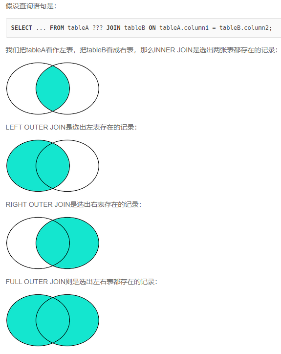

# 数据库

### 数据库事务

- 是指作为单个逻辑工作单元执行的一系列操作，这些操作要么全做，要么全不做，是一个不可分割的工作单元。

- 把多条语句作为一个整体进行操作的功能，被称为数据库事务。数据库事务可以确保该事务范围内的所有操作都可以全部成功或者全部失败。如果事务失败，那么效果就和没有执行这些SQL一样，不会对数据库数据有任何改动。

#### 事务特点

- A：Atomic，原子性，将所有SQL作为原子工作单元执行，要么全部执行，要么全部不执行；
- C：Consistent，一致性，事务完成后，所有数据的状态都是一致的，即A账户只要减去了100，B账户则必定加上了100；
- I：Isolation，隔离性，如果有多个事务并发执行，每个事务作出的修改必须与其他事务隔离；
- D：Duration，持久性，即事务完成后，对数据库数据的修改被持久化存储。

#### 事务并发产生的问题

- 脏读：读到未提交更新的数据
- 不可重复读：读到已经提交更新的数据，但一个事务范围内两个相同的查询却返回了不同数据。
- 幻读：读到已提交插入数据，幻读与不可重复读类似，幻读是查询到了另一个事务已提交的新插入数据，而不可重复读是查询到了另一个事务已提交的更新数据。
- 不可重复读是由于数据修改引起的，幻读是由数据插入或者删除引起的。

#### 事务隔离

- READ-UNCOMMITTED(读取未提交)： 最低的隔离级别，允许读取尚未提交的数据变更，可能会导致脏读、幻读或不可重复读。
- READ-COMMITTED(读取已提交)：允许读取并发事务已经提交的数据，可以阻止脏读，但是幻读或不可重复读仍有可能发生。
- REPEATABLE-READ(可重复读)：对同一字段的多次读取结果都是一致的，除非数据是被本身事务自己所修改，可以阻止脏读和不可重复读，但幻读仍有可能发生。
- SERIALIZABLE(可串行化)：最高的隔离级别，完全服从ACID的隔离级别。所有的事务依次逐个执行，这样事务之间就完全不可能产生干扰，也就是说，该级别可以防止脏读、不可重复读以及幻读。

### 索引的作用和优缺点

索引是关系数据库中对某一列或多个列的值进行预排序的数据结构。通过使用索引，可以让数据库系统不必扫描整个表，而是直接定位到符合条件的记录，这样就大大加快了查询速度。

#### 优点：

1)        通过创建唯一性索引，可以保证数据库表中每一行数据的唯一性

2)        可以大大加快 数据的检索速度，这也是创建索引的最主要的原因

3)        可以加速表和表之间的连接，特别是在实现数据的参考完整性方面特别有意义

4)        在使用分组和排序 子句进行数据检索时，同样可以显著减少查询中分组和排序的时间

5)        通过使用索引，可以在查询的过程中，使用优化隐藏器，提高系统的性能

#### 缺点：

1)        创建索引和维护索引要耗费时间，这种时间随着数据量的增加而增加

2)        索引需要占物理空间，除了数据表占数据空间之外，每一个索引还要占一定的物理空间，如果要建立聚簇索引，那么需要的空间就会更大

3)        当对表中的数据进行增加、删除和修改的时候，索引也要动态的维护，这样就降低了数据的维护速度


### SQL语言

- DDL：Data Definition Language

  DDL允许用户定义数据，也就是创建表、删除表、修改表结构这些操作。通常，DDL由数据库管理员执行。

- DML：Data Manipulation Language

  DML为用户提供添加、删除、更新数据的能力，这些是应用程序对数据库的日常操作。

- DQL：Data Query Language

  DQL允许用户查询数据，这也是通常最频繁的数据库日常操作。

#### SQL语句

各个关键字的执行先后顺序
`from > on > join > where >  group by > with > having > select > distinct  > order by  > limit`

##### 查询语句

- `SELECT id, name, gender, score FROM students ORDER BY score DESC;`

- `SELECT COUNT(*) FROM students WHERE gender = 'M';`

  `COUNT(*)`表示查询所有列的行数，要注意聚合的计算结果虽然是一个数字，但查询的结果仍然是一个二维表，只是这个二维表只有一行一列，并且列名是`COUNT(*)`。

- `SELECT AVG(column_name) FROM table_name` 返回平均值，类似的 `MAX(), MIN(), SUM()` 

- 通常，使用聚合查询时，我们应该给列名设置一个别名，便于处理结果。

  ```sql
  SELECT
      s.id sid,
      s.name,
      s.gender,
      s.score,
      c.id cid,
      c.name cname
  FROM students s, classes c
  WHERE s.gender = 'M' AND c.id = 1;
  
  SELECT id, name, gender, score
  FROM students
  ORDER BY score DESC
  LIMIT 3 OFFSET 0;
  ```

- 把结果集分页，每页3条记录，要获取第1页的记录，可以使用`LIMIT 3 OFFSET 0`，查询第二页`LIMIT 3 OFFSET 3;` 

- 每页3条记录，通过聚合查询获得总页数，`SELECT CEILING(COUNT(*) / 3) FROM students;` 

- `SELECT COUNT(*) num FROM students GROUP BY class_id;` 把`class_id`相同的列先分组，再分别计算，因此，得到多行结果

##### 连接查询

连接查询对多个表进行JOIN运算，简单地说，就是先确定一个主表作为结果集，然后，把其他表的行有选择性地“连接”在主表结果集上。



- `SELECT ... FROM <表1> INNER JOIN <表2> ON <条件...>` 
- outer join 包括 left join , right join 和full join

##### 修改语句

- `INSERT INTO <表名> (字段1, 字段2, ...) VALUES (值1, 值2, ...);`

- `UPDATE <表名> SET 字段1=值1, 字段2=值2, ... WHERE ...;`

- `DELETE FROM <表名> WHERE ...;`

#### 外键

- 在students表中，通过class_id的字段，可以把数据与另一张表关联起来，这种列称为外键。

- 外键并不是通过列名实现的，而是通过定义外键约束实现的。

    ```sql
    ALTER TABLE students
    ADD CONSTRAINT fk_class_id
    FOREIGN KEY (class_id)
    REFERENCES classes (id);
    ```

- 外键约束的名称`fk_class_id`可以任意，`FOREIGN KEY (class_id)`指定了`class_id`作为外键，`REFERENCES classes (id)`指定了这个外键将关联到`classes`表的`id`列（即`classes`表的主键）。

#### 例子

- 查找重复的电子邮箱

  ```sql
  select Email
  from Person
  group by Email
  having count(Email) > 1;
  ```

- 第二高的薪水

  ```sql
  SELECT
  (SELECT DISTINCT Salary
  FROM Employee ORDER BY Salary DESC
  LIMIT 1 OFFSET 1)
  AS SecondHighestSalary;
  ```

- 大的国家

  ```sql
  SELECT
      name, population, area
  FROM
      world
  WHERE
      area > 3000000
  
  UNION
  
  SELECT
      name, population, area
  FROM
      world
  WHERE
      population > 25000000
  ;
  ```

  使用 or 会使索引会失效，在数据量较大的时候查找效率较低，通常建议使用 union 代替 or

- 交换工资

  ```sql
  UPDATE salary
  SET
      sex = CASE sex
          WHEN 'm' THEN 'f'
          ELSE 'm'
      END;
  ```

- 超过经理收入的员工

  ```sql
  SELECT
      a.Name AS 'Employee'
  FROM
      Employee AS a,
      Employee AS b
  WHERE
      a.ManagerId = b.Id
          AND a.Salary > b.Salary
  ;
  
  
  SELECT
       a.NAME AS Employee
  FROM Employee AS a JOIN Employee AS b
       ON a.ManagerId = b.Id
       AND a.Salary > b.Salary
  ;
  ```

- 有趣的电影

  ```sql
  select * from cinema
  where description != "boring" and mod(id, 2) = 1
  order by rating desc;
  ```

  

## 参考

https://www.liaoxuefeng.com/wiki/1177760294764384/1246617682185952