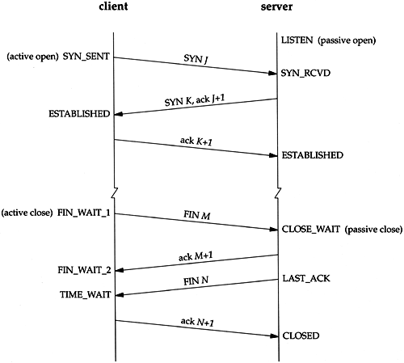

## 网络基础

### 协议

- 计算机与计算机之间通过网络实现通信时事前达成的“约定”，遵循相同的协议进行处理才能实现通信
- 如同人和人的对话

### 协议的分层 OSI参考模型

- 每个分层接收下一层所提供的服务，并负责为上一次提供服务
- 像打电话，说的话是语言层，手机是设备层

#### 应用层

#### 表示层

- 将从某个计算机特定的数据格式转换为网络通用的标准数据格式
- 统一网络数据格式

#### 会话层

- 决定采用何种连接方法
- 决定建立连接和断开连接的时机
- 标记发送顺序

#### 传输层

- 实际建立或断开连接，建立逻辑上的通信
- 保证数据传输的可靠性

#### 网络层

- 在网络互联的环境中，将数据从发送端送至接收端（目的地址）

#### 数据链路层

- 在传输介质互连的设备之间进行数据处理
- 相互直连的设备之间使用MAC地址实现传输

#### 物理层

- 将0、1数据转换为电压和脉冲光传输给物理的传输介质

### 分组交换

- 发端将数据分成多个数据包，按照一定顺序分别发送

## TCP/IP

利用IP进行通信时用到的协议的统称，包括IP、TCP、FTP、HTTP等等

### TCP报文

- ACK=1，确认序号有效；SYN=1，表示是新的连接；FIN=1，要结束连接

### 连接的建立和销毁

#### 三次握手

1. 主机client主动发送SYN数据包到服务器server，即Seq=x，SYN=1，序列号随机生成为x，SYN位置1表示32位序列号为初始序列号，主机client需要和server建立连接。
2. 服务器server收到请求并响应主机client，向client发送SYN+ACK数据包，即Seq=y，Ack=x+1，SYN=1，ACK=1。ACK为1表示这是一个确认包，Ack为32位确认位，将x序列号+1表示已经收到x+1之前的所有数据包。Seq=1，SYN=y，表示服务器也需要和client建立连接。
3. 主机client收到服务器server的数据包，向服务器发送ACK报文数据，即Seq=x+1，Ack=y+1，ACK=1，ACK为1表示一个确认包，确认内容为y+1，现在可以开始建立TCP连接了。

#### 四次挥手

1. 首先主机client需要和服务器server断开连接，于是向server发送FIN/ACK数据包，即FIN=1，ACK=1，FIN置1表示请求断开连接。
2. 服务器server回应请求并发送ACK报文，即ACK=1，表示我知道你要断开了。此时客户端已经没有数据要发送了，但是服务器若发送数据，客户端依然要接受
3. 服务器server向主机client请求断开连接，同样向client发送FIN/ACK报文，即FIN=1，ACK=1.
4. 主机client同样回应断开请求，发送ACK报文，ACK=1，此时服务器已和主机TCP连接断开。

### 参考

- [三次握手和四次挥手](https://snailclimb.gitee.io/javaguide/#/docs/network/计算机网络?id=二-tcp-三次握手和四次挥手面试常客)
- http://www.srcmini.com/628.html
- https://blog.csdn.net/qzcsu/article/details/72861891