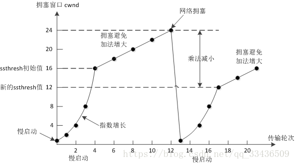
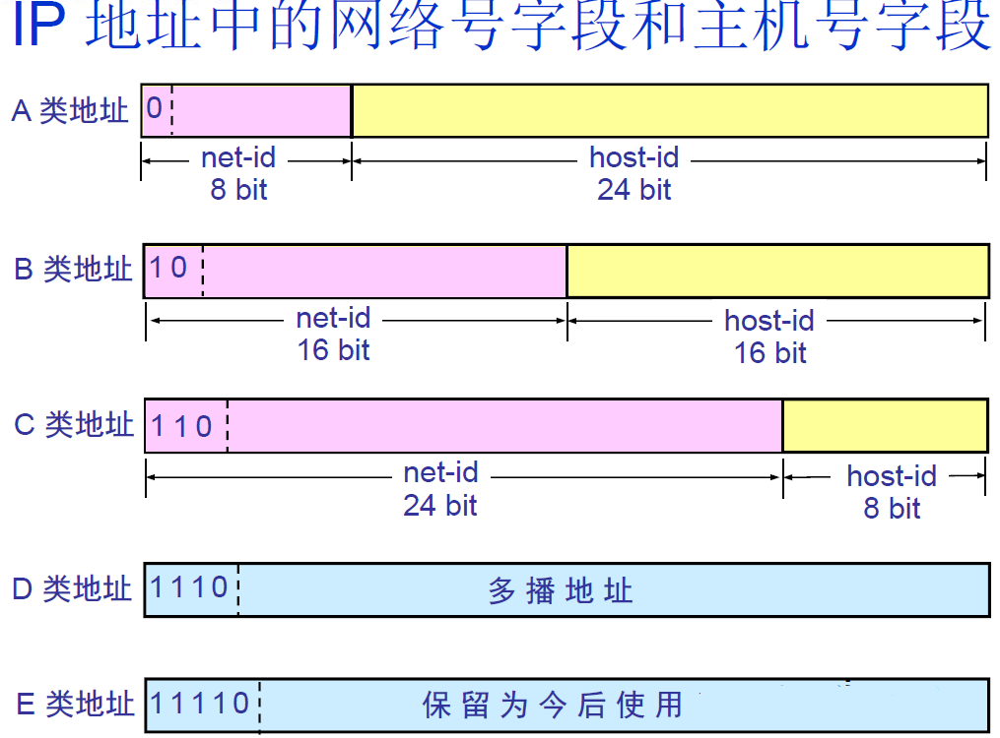

# 计算机网络

## 计算机网络体系结构

- Physical, Data Link, Network, Transport, Application
- 每个分层接收下一层所提供的服务，并负责为上一层提供服务
- 计算机与计算机之间通过网络实现通信时事前达成的“约定”，遵循相同的协议进行处理才能实现通信
- 应用层：常见协议：
  - FTP(21端口)：文件传输协议
  - SSH(22端口)：远程登陆
  - TELNET(23端口)：远程登录
  - SMTP(25端口)：发送邮件
  - POP3(110端口)：接收邮件
  - HTTP(80端口)：超文本传输协议
  - DNS(53端口)：运行在UDP上，域名解析服务
- 传输层：TCP/UDP
- 网络层：IP、ARP、NAT、RIP...

#### 路由器、交换机位于哪一层？

- 路由器网络层，根据IP地址进行寻址；
- 交换机数据链路层，根据MAC地址进行寻址。
- 因为**路由器**是基于 IP 设计的，俗称**三层**网络设备，路由器的各个端口都具有 MAC 地址和 IP 地址；
- 而**交换机**是基于以太网设计的，俗称**二层**网络设备，交换机的端口不具有 MAC 地址。

## 应用层

### RIP (Routing Information Protocol, 距离矢量路由协议)

- `RIP`是一种**内部网关协议（IGP）**，一种**动态路由选择协议**，用于自治系统（AS）内的路由信息的传递
- 在内网的多个路由器之间自动的学习，同步路由表以计算出一个去往目标网络的最短、无环的数据转发路径。
- RIP协议**基于距离矢量算法（DistanceVectorAlgorithms）** 

- 每个路由器维护一张表，记录该路由器到其它网络的”跳数“，路由器到与其直接连接的网络的跳数是1，每多经过一个路由器跳数就加1；更新该表时和相邻路由器交换路由信息；路由器允许一个路径最多包含15个路由器，如果跳数为16，则不可达。交付数据报时优先选取距离最短的路径。

### HTTP 和 HTTPS 区别

1. 端口不同：HTTP使用的是80端口，HTTPS使用443端口；
2. HTTP（超文本传输协议）信息是明文传输，HTTPS运行在SSL(Secure Socket Layer)之上，添加了加密和认证机制，更加安全；
3. HTTPS由于加密解密会带来更大的CPU和内存开销；
4. HTTPS通信需要证书，一般需要向证书颁发机构（CA）购买

### Https的连接过程

1. 客户端向服务器发送请求，同时发送客户端支持的一套加密规则（包括对称加密、非对称加密、摘要算法）；
2. 服务器从中选出一组加密算法与HASH算法，并将自己的身份信息以证书的形式发回给浏览器。证书里面包含了网站地址，**加密公钥**（用于非对称加密），以及证书的颁发机构等信息（证书中的私钥只能用于服务器端进行解密）；
3. 客户端验证服务器的合法性，包括：证书是否过期，CA 是否可靠，发行者证书的公钥能否正确解开服务器证书的“发行者的数字签名”，服务器证书上的域名是否和服务器的实际域名相匹配；
4. 如果证书受信任，或者用户接收了不受信任的证书，浏览器会生成一个**随机密钥**（用于对称算法），并用服务器提供的公钥加密（采用非对称算法对密钥加密）；使用Hash算法对握手消息进行**摘要**计算，并对摘要使用之前产生的密钥加密（对称算法）；将加密后的随机密钥和摘要一起发送给服务器；
5. 服务器使用自己的私钥解密，得到对称加密的密钥，用这个密钥解密出Hash摘要值，并验证握手消息是否一致；如果一致，服务器使用对称加密的密钥加密握手消息发给浏览器；
6. 浏览器解密并验证摘要，若一致，则握手结束。之后的数据传送都使用对称加密的密钥进行加密

总结：非对称加密算法用于在握手过程中加密生成的密码；对称加密算法用于对真正传输的数据进行加密；HASH算法用于验证数据的完整性。

### 你访问的网站是如何自动切换到 HTTPS 的？

- 一种是原始的302跳转，服务器把所有的 HTTP 流量跳转到 HTTPS。但这样有一个漏洞，就是中间人可能在第一次访问站点的时候就劫持。

- 解决方法是引入HSTS机制，用户浏览器在访问站点的时候强制使用HTTPS。

- 通过 HTTPS 协议访问你站点的时候，在相应头中加上这样一段信息：

  `Strict-Transport-Security "max-age=63072000; includeSubdomains;"`

  `Strict-Transport-Security` 是 Header 字段名， 后面的 `max-age` 代表 HSTS 在客户端的生效时间。 `includeSubdomains` 表示对所有子域名生效。

- 这里面的 `Strict-Transport-Security 头就是 HSTS` 的信息了。 其实在服务端上，只需要发送这个头就可以了。具体的实现都在客户端上，也就是你的浏览器。 当浏览器检测到这样的 Header 信息后，就会做一个记录，根据 max-age 的提示，在一定时间内用户再次访问这个站点的时候就直接使用 HTTPS 协议请求，如果 HTTPS 请求失败，也不会降级到 HTTP 而是直接失败。

- 用户的浏览器一旦得到了 HSTS 的信息，下次再访问站点的时候客户端浏览器就会强制使用 HTTPS。HSTS 本身也有缺陷，假如用户的浏览器从未访问过这个站点，那也就不会得到 HSTS 响应头， 这个时候依然会有被劫持风险， 但相比每次都进行服务端跳转的机制，已经好了不少。主流的浏览器也提供了一些解决方案，比如把一些大流量并且已知支持 HSTS 的站点预先内置到浏览器中，这样就更大程度的完善了 HTTPS 的安全机制。

### 什么是对称加密、非对称加密？区别是什么？

- 对称加密：加密和解密采用相同的密钥。如：DES、RC2、RC4
- 非对称加密：需要两个密钥：公钥和私钥。如果用公钥加密，需要用私钥才能解密。如：RSA
- 区别：对称加密速度更快，通常用于大量数据的加密；非对称加密安全性更高（不需要传送私钥）

### GET与POST的区别？

1. GET是幂等的，即读取同一个资源，总是得到相同的数据，POST不是幂等的；
2. GET一般用于从服务器获取资源，而POST有可能改变服务器上的资源；
3. 请求形式上：GET请求的数据附在URL之后，在HTTP请求头中；POST请求的数据在请求体中；
4. 安全性：GET请求可被缓存、收藏、保留到历史记录，且其请求数据明文出现在URL中。POST的参数不会被保存，安全性相对较高；
5. GET只允许ASCII字符，POST对数据类型没有要求，也允许二进制数据；
6. GET的长度有限制（操作系统或者浏览器），而POST数据大小无限制

### Session与Cookie的区别？

- Session是服务器端保持状态的方案，Cookie是客户端保持状态的方案

- Cookie保存在客户端本地，客户端请求服务器时会将Cookie一起提交；Session保存在服务端，通过检索Sessionid查看状态。保存Sessionid的方式可以采用Cookie，如果禁用了Cookie，可以使用URL重写机制（把会话ID保存在URL中）。

- Session的实现常常依赖于Cookie机制，通过Cookie机制回传SessionID（若浏览器禁用Cookie的话，可以通过 URL重写机制 将sessionid传回服务器）
- 大小限制：Cookie有大小限制并且浏览器对每个站点也有cookie的个数限制，Session没有大小限制，理论上只与服务器的内存大小有关；
- 安全性：Cookie存在安全隐患，通过拦截或本地文件找得到cookie后可以进行攻击，而Session由于保存在服务器端，相对更加安全；
- 服务器资源消耗：Session是保存在服务器端上会存在一段时间才会消失，如果session过多会增加服务器的压力。

### 从输入网址到获得页面的过程

1. 浏览器查询 DNS(Domain Name System)，获取域名对应的IP地址：具体过程包括浏览器搜索自身的DNS缓存、搜索操作系统的DNS缓存、读取本地的Host文件和向本地DNS服务器进行查询等。对于向本地DNS服务器进行查询，如果要查询的域名包含在本地配置区域资源中，则返回解析结果给客户机，完成域名解析(此解析具有权威性)；如果要查询的域名不由本地DNS服务器区域解析，但该服务器已缓存了此网址映射关系，则调用这个IP地址映射，完成域名解析（此解析不具有权威性）。如果本地域名服务器并未缓存该网址映射关系，那么将根据其设置发起递归查询或者迭代查询，如本地 DNS 会去问它的根域名服务器；

   

2. 浏览器获得域名对应的IP地址以后，浏览器向服务器请求建立链接，发起三次握手；

3. TCP/IP链接建立起来后，浏览器向服务器发送HTTP请求；

4. 服务器接收到这个请求，并根据路径参数映射到特定的请求处理器进行处理，并将处理结果及相应的视图返回给浏览器；

5. 浏览器解析并渲染视图，若遇到对js文件、css文件及图片等静态资源的引用，则重复上述步骤并向服务器请求这些资源；

6. 浏览器根据其请求到的资源、数据渲染页面，最终向用户呈现一个完整的页面。

### HTTP请求有哪些常见状态码？

1. 1xx状态码 : 请求处理中，请求已被接受，正在处理
2. 2xx状态码：操作成功。200 OK
3. 3xx状态码：重定向。301 永久重定向；302暂时重定向
4. 4xx状态码：客户端错误。400 Bad Request；401 Unauthorized；403 Forbidden；404 Not Found；
5. 5xx状态码：服务端错误。500服务器内部错误；501服务不可用

## 表示层

- 将从某个计算机特定的数据格式转换为网络通用的标准数据格式
- 统一网络数据格式

## 会话层

- 决定采用何种连接方法
- 决定建立连接和断开连接的时机
- 标记发送顺序

## 传输层

实际建立或断开连接，建立逻辑上的通信

### 什么是三次握手 (three-way handshake)？

- 第一次握手：Client将SYN置1，随机产生一个初始序列号seq发送给Server，进入SYN_SENT状态；
- 第二次握手：Server收到Client的SYN=1之后，知道客户端请求建立连接，将自己的SYN置1，ACK置1，产生一个acknowledge number=sequence number+1，并随机产生一个自己的初始序列号，发送给客户端；进入SYN_RCVD状态；
- 第三次握手：客户端检查acknowledge number是否为序列号+1，ACK是否为1，检查正确之后将自己的ACK置为1，产生一个acknowledge number=服务器发的序列号+1，发送给服务器；进入ESTABLISHED状态；服务器检查ACK为1和acknowledge number为序列号+1之后，也进入ESTABLISHED状态；完成三次握手，连接建立。

##### TCP建立连接可以两次握手吗？为什么?

不可以。有两个原因：

首先，可能会出现**已失效的连接请求报文段又传到了服务器端**。

> client 发出的第一个连接请求报文段并没有丢失，而是在某个网络结点长时间的滞留了，以致延误到连接释放以后的某个时间才到达 server。本来这是一个早已失效的报文段。但 server 收到此失效的连接请求报文段后，就误认为是 client 再次发出的一个新的连接请求。于是就向 client 发出确认报文段，同意建立连接。假设不采用 “三次握手”，那么只要 server 发出确认，新的连接就建立了。由于现在 client 并没有发出建立连接的请求，因此不会理睬 server 的确认，也不会向 server 发送数据。但 server 却以为新的运输连接已经建立，并一直等待 client 发来数据。这样，server 的很多资源就白白浪费掉了。采用 “三次握手” 的办法可以防止上述现象发生。例如刚才那种情况，client 不会向 server 的确认发出确认。server 由于收不到确认，就知道 client 并没有要求建立连接。

其次，两次握手无法保证Client正确接收第二次握手的报文（Server无法确认Client是否收到），也无法保证Client和Server之间成功互换初始序列号。

##### 可以采用四次握手吗？为什么？

可以。但是会降低传输的效率。

四次握手是指：第二次握手：Server只发送ACK和acknowledge number；而Server的SYN和初始序列号在第三次握手时发送；原来协议中的第三次握手变为第四次握手。出于优化目的，四次握手中的二、三可以合并。

##### 第三次握手中，如果客户端的ACK未送达服务器，会怎样？

Server端： 
由于Server没有收到ACK确认，因此会重发之前的SYN+ACK（默认重发五次，之后自动关闭连接进入CLOSED状态），Client收到后会重新传ACK给Server。

Client端，两种情况： 

1. 在Server进行超时重发的过程中，如果Client向服务器发送数据，数据头部的ACK是为1的，所以服务器收到数据之后会读取 ACK number，进入 establish 状态  
2. 在Server进入CLOSED状态之后，如果Client向服务器发送数据，服务器会以RST包应答。

##### 如果已经建立了连接，但客户端出现了故障怎么办？

服务器每收到一次客户端的请求后都会重新复位一个计时器，时间通常是设置为2小时，若两小时还没有收到客户端的任何数据，服务器就会发送一个探测报文段，以后每隔75秒钟发送一次。若一连发送10个探测报文仍然没反应，服务器就认为客户端出了故障，接着就关闭连接。

##### 初始序列号是什么？

TCP连接的一方A，随机选择一个32位的序列号（Sequence Number）作为发送数据的初始序列号（Initial Sequence Number，ISN），比如为1000，以该序列号为原点，对要传送的数据进行编号：1001、1002...三次握手时，把这个初始序列号传送给另一方B，以便在传输数据时，B可以确认什么样的数据编号是合法的；同时在进行数据传输时，A还可以确认B收到的每一个字节，如果A收到了B的确认编号（acknowledge number）是2001，就说明编号为1001-2000的数据已经被B成功接受。

### 什么是四次挥手？

- 第一次挥手：Client将FIN置为1，发送一个序列号seq给Server；进入FIN_WAIT_1状态；
- 第二次挥手：Server收到FIN之后，发送一个ACK=1，acknowledge number=收到的序列号+1；进入CLOSE_WAIT状态。此时客户端已经没有要发送的数据了，但仍可以接受服务器发来的数据。
- 第三次挥手：Server将FIN置1，发送一个序列号给Client；进入LAST_ACK状态；
- 第四次挥手：Client收到服务器的FIN后，进入TIME_WAIT状态；接着将ACK置1，发送一个acknowledge number=序列号+1给服务器；服务器收到后，确认acknowledge number后，变为CLOSED状态，不再向客户端发送数据。客户端等待2*MSL（报文段最长寿命）时间后，也进入CLOSED状态。完成四次挥手。

##### 为什么不能把服务器发送的ACK和FIN合并起来，变成三次挥手（CLOSE_WAIT状态意义是什么）？

因为服务器收到客户端断开连接的请求时，可能还有一些数据没有发完，这时先回复ACK，表示接收到了断开连接的请求。等到数据发完之后再发FIN，断开服务器到客户端的数据传送。

##### 如果第二次挥手时服务器的ACK没有送达客户端，会怎样？

客户端没有收到ACK确认，会重新发送FIN请求。

##### 客户端TIME_WAIT状态的意义是什么？

第四次挥手时，客户端发送给服务器的ACK有可能丢失，TIME_WAIT状态就是用来重发可能丢失的ACK报文。如果Server没有收到ACK，就会重发FIN，如果Client在2*MSL的时间内收到了FIN，就会重新发送ACK并再次等待2MSL，防止Server没有收到ACK而不断重发FIN。

MSL(Maximum Segment Lifetime)，指一个片段在网络中最大的存活时间，2MSL就是一个发送和一个回复所需的最大时间。如果直到2MSL，Client都没有再次收到FIN，那么Client推断ACK已经被成功接收，则结束TCP连接。

### TCP滑动窗口实现流量控制

- 使用滑动窗口协议实现流量控制。防止发送方发送速率太快，接收方缓存区不够导致溢出。窗口是缓存的一部分，用来暂时存放字节流。

- 接收方会维护一个接收窗口 receiver window（窗口大小单位是字节），接受窗口的大小是根据自己的资源情况动态调整的。
- 接收方通过 TCP 报文段中的窗口字段告诉发送方自己的窗口大小，发送方根据这个值和其它信息设置自己的窗口大小。
- 发送窗口的大小不能超过接受窗口的大小，只有当发送方发送并收到确认之后，才能将发送窗口右移。

- 发送窗口的上限为接受窗口和拥塞窗口中的较小值。接受窗口表明了接收方的接收能力，拥塞窗口表明了网络的传送能力。

#### 处理流程

发送窗口内的字节都允许被发送，接收窗口内的字节都允许被接收。如果发送窗口左部的字节已经发送并且收到了确认，那么就将发送窗口向右滑动一定距离，直到左部第一个字节不是已发送并且已确认的状态；接收窗口的滑动类似，接收窗口左部字节已经发送确认并交付主机，就向右滑动接收窗口。

接收窗口只会对窗口内最后一个按序到达的字节进行确认，例如接收窗口已经收到的字节为 {31, 34, 35}，其中 {31} 按序到达，而 {34, 35} 就不是，因此只对字节 31 进行确认。发送方得到一个字节的确认之后，就知道这个字节之前的所有字节都已经被接收。

#### 什么是零窗口（接收窗口为0时会怎样）？

如果接收方没有能力接收数据，就会将接收窗口设置为0，这时发送方必须暂停发送数据，但是会启动一个持续计时器(persistence timer)，到期后发送一个大小为1字节的探测数据包，以查看接收窗口状态。如果接收方能够接收数据，就会在返回的报文中更新接收窗口大小，恢复数据传送。

### TCP的拥塞控制是怎么实现的？

拥塞控制主要由四个算法组成：**慢启动（Slow Start）、拥塞避免（Congestion voidance）、快重传 （Fast Retransmit）、快恢复（Fast Recovery）**

1. 慢启动：刚开始发送数据时，先把拥塞窗口（congestion window）设置为一个最大报文段MSS的数值，每收到一个新的确认报文之后，就把拥塞窗口加1个MSS。这样每经过一个传输轮次（或者说是每经过一个往返时间RTT），拥塞窗口的大小就会加倍

2. 拥塞避免：当拥塞窗口的大小达到慢开始门限(slow start threshold)时，开始执行拥塞避免算法，拥塞窗口大小不再指数增加，而是线性增加，即每经过一个传输轮次只增加1MSS.  

> 无论在慢开始阶段还是在拥塞避免阶段，只要发送方判断网络出现拥塞（其根据就是没有收到确认），就要把慢开始门限ssthresh设置为出现拥塞时的发送方窗口值的一半（但不能小于2）。然后把拥塞窗口cwnd重新设置为1，执行慢开始算法。**（这是不使用快重传的情况）**

3. 快重传：快重传要求接收方在收到一个失序的报文段后就立即发出**重复确认**（为的是使发送方及早知道有报文段没有到达对方）而不要等到自己发送数据时捎带确认。快重传算法规定，发送方只要一连收到三个重复确认就应当立即重传对方尚未收到的报文段，而不必继续等待设置的重传计时器时间到期。

4. 快恢复：当发送方连续收到三个重复确认时，就把慢开始门限减半，然后执行拥塞避免算法。不执行慢开始算法的原因：因为如果网络出现拥塞的话就不会收到好几个重复的确认，所以发送方认为现在网络可能没有出现拥塞。 
   也有的快重传是把开始时的拥塞窗口cwnd值再增大一点，即等于 ssthresh + 3*MSS 。这样做的理由是：既然发送方收到三个重复的确认，就表明有三个分组已经离开了网络。这三个分组不再消耗网络的资源而是停留在接收方的缓存中。可见现在网络中减少了三个分组。因此可以适当把拥塞窗口扩大些。
   
   
   
   - `MTU`：一个网络包的最大长度，以太网中一般为 `1500` 字节。
   - `MSS`：除去 IP 和 TCP 头部之后，一个网络包所能容纳的 TCP 数据的最大长度。

### TCP与UDP的区别

1. TCP是面向连接的，UDP是无连接的（UDP发送数据之前不需要建立连接）
2. TCP是可靠的，UDP不可靠（UDP接收方收到报文后，不需要给出任何确认）
3. TCP只支持点对点通信，UDP支持一对一、一对多、多对一、多对多；
4. TCP是面向字节流的，UDP是面向报文的；
   面向字节流是指发送数据时以字节为单位，一个数据包可以拆分成若干组进行发送，而UDP一个报文只能一次发完。
5. TCP有拥塞控制机制，UDP没有。网络出现的拥塞不会使源主机的发送速率降低，这对某些实时应用是很重要的，比如媒体通信，游戏；
6. TCP首部开销（20字节）比UDP首部开销（8字节）要大
7. UDP 的主机不需要维持复杂的连接状态表

##### 什么时候选择TCP，什么时候选UDP？

对某些实时性要求比较高的情况，选择UDP，比如游戏，媒体通信，实时视频流（直播），即使出现传输错误也可以容忍；其它大部分情况下，HTTP都是用TCP，因为要求传输的内容可靠，不出现丢失

##### HTTP可以使用UDP吗？

HTTP不可以使用UDP，HTTP需要基于可靠的传输协议，而UDP不可靠

### TCP如何保证传输的可靠性

1. 数据包校验
2. 对失序数据包重新排序（TCP报文具有序列号）
3. 丢弃重复数据
4. 应答机制：接收方收到数据之后，会发送一个确认（通常延迟几分之一秒）；
5. 超时重发：发送方发出数据之后，启动一个定时器，超时未收到接收方的确认，则重新发送这个数据；
6. 流量控制：确保接收端能够接收发送方的数据而不会缓冲区溢出

## 网络层

在网络互联的环境中，将数据从发送端送至接收端（目的地址）

### IP地址的分类

- 网络号 net-id，它标志主机（或路由器）所连接到的网络，网络地址表示其属于互联网的哪一个网络
- 主机号 host-id，它标志该主机（或路由器），主机地址表示其属于该网络中的哪一台主机。
- 路由器仅根据网络号net-id来转发分组，当分组到达目的网络的路由器之后，再按照主机号host-id将分组交付给主机；同一网络上的所有主机的网络号相同。

#### A、B、C、D、E类地址

A类地址以00开头，第一个字节作为网络号，地址范围为：0.0.0.0~127.255.255.255；

B类地址以10开头，前两个字节作为网络号，地址范围是：128.0.0.0~191.255.255.255;

C类地址以110开头，前三个字节作为网络号，地址范围是：192.0.0.0~223.255.255.255。

D类地址以1110开头，地址范围是224.0.0.0~239.255.255.255，D类地址作为组播地址（一对多的通信）；

E类地址以1111开头，地址范围是240.0.0.0~255.255.255.255，E类地址为保留地址，供以后使用。

注：只有A,B,C有网络号和主机号之分，D类地址和E类地址没有划分网络号和主机号。

### 划分子网

- 从主机号host-id借用若干个比特作为子网号subnet-id；
- 子网掩码：网络号和子网号都为1，主机号为0；
- 数据报仍然先按照网络号找到目的网络，发送到路由器，路由器再按照网络号和子网号找到目的子网：将子网掩码与目标地址逐比特与操作，若结果为某个子网的网络地址，则送到该子网。

### ARP协议 (Address Resolution Protocol)

- ARP协议完成了IP地址与物理地址的映射。每一个主机都设有一个 ARP 高速缓存，里面有**所在的局域网**上的各主机和路由器的 IP 地址到硬件地址的映射表。
- 当源主机要发送数据包到目的主机时，会先检查自己的ARP高速缓存中有没有目的主机的MAC地址，如果有，就直接将数据包发到这个MAC地址，如果没有，就向**所在的局域网**发起一个ARP请求的广播包（在发送自己的 ARP 请求时，同时会带上自己的 IP 地址到硬件地址的映射），收到请求的主机检查自己的IP地址和目的主机的IP地址是否一致，如果一致，则先保存源主机的映射到自己的ARP缓存，然后给源主机发送一个ARP响应数据包。源主机收到响应数据包之后，先添加目的主机的IP地址与MAC地址的映射，再进行数据传送。如果源主机一直没有收到响应，表示ARP查询失败。

- 如果所要找的主机和源主机不在同一个局域网上，那么就要通过 ARP 找到一个位于本局域网上的某个路由器的硬件地址，然后把分组发送给这个路由器，让这个路由器把分组转发给下一个网络。剩下的工作就由下一个网络来做。

### NAT (Network Address Translation, 网络地址转换)

用于解决内网中的主机要和因特网上的主机通信。由NAT路由器将主机的本地IP地址转换为全球IP地址，分为静态转换（转换得到的全球IP地址固定不变）和动态NAT转换。

## 数据链路层

- 在传输介质互连的设备之间进行数据处理
- 相互直连的设备之间使用MAC地址实现传输

### 交换机

- 计算机的网卡本身具有 MAC 地址，并通过核对收到的包的接收方 MAC 地址判断是不是发给自己的，如果不是发给自己的则丢弃；相对地，交换机的端口不核对接收方 MAC 地址，而是直接接收所有的包并存放到缓冲区中。

- 交换机的端口不具有 MAC 地址

- 交换机的 MAC 地址表

  

- 地址表中找不到指定的 MAC 地址。这可能是因为具有该地址的设备还没有向交换机发送过包，或者这个设备一段时间没有工作导致地址被从地址表中删除了。

  这种情况下，交换机无法判断应该把包转发到哪个端口，只能将包转发到除了源端口之外的所有端口上，无论该设备连接在哪个端口上都能收到这个包。

  只有相应的接收者才接收包，而其他设备则会忽略这个包。

## 物理层

- 将0、1数据转换为电压和脉冲光传输给物理的传输介质

- 分组交换：发端将数据分成多个数据包，按照一定顺序分别发送

## 参考

- [三次握手和四次挥手](https://snailclimb.gitee.io/javaguide/#/docs/network/计算机网络?id=二-tcp-三次握手和四次挥手面试常客)
- http://www.srcmini.com/628.html
- https://blog.csdn.net/qzcsu/article/details/72861891
- [面试/笔试第一弹 —— 计算机网络面试问题集锦](https://blog.csdn.net/justloveyou_/article/details/78303617)
- [什么时候选TCP、UDP？](https://blog.csdn.net/yjxsdzx/article/details/71937886)

