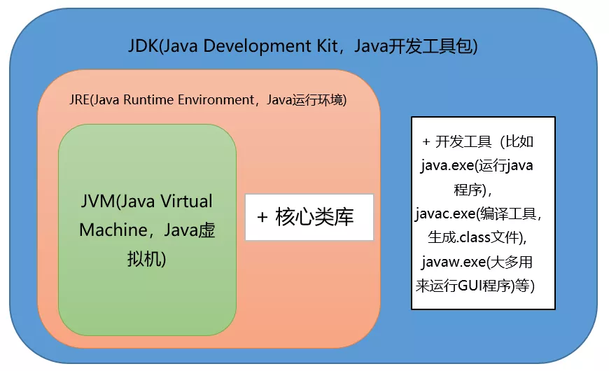
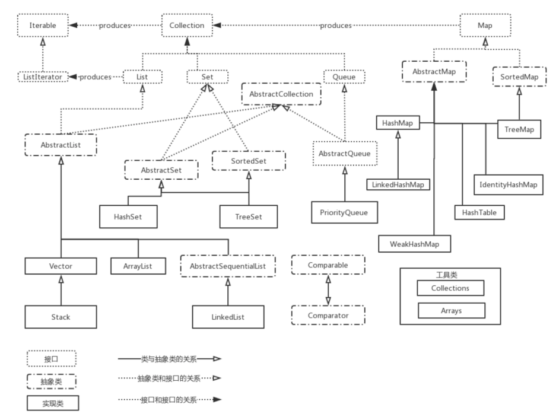

# Java

## 语言特点

- 面向对象（封装，继承，多态）
  - 把构成问题的事务分解成各个对象 
  - 为了描述某个事物在解决整个问题的过程中所发生的行为 
  - 易维护、易复用、易扩展。可以设计出低耦合的系统。 但是性能上来说，比面向过程要低 
- Java 虚拟机实现平台无关性
- Java 语言提供了多线程支持
- Java 语言诞生本身就是为简化网络编程设计的，因此 Java 语言不仅支持网络编程而且很方便

## JVM


- Java 虚拟机（JVM）是运行 Java 字节码的虚拟机。
- JVM 可以理解的代码就叫做字节码（即扩展名为 `.class` 的文件），它不面向任何特定的处理器，只面向虚拟机
- 字节码并不针对一种特定的机器，因此Java 程序无须重新编译便可在多种不同操作系统的计算机上运行
- 同一个程序，不同平台的 javac 编译后是相同的字节码；JVM 把字节码转换为机器码，因为针对不同系统有特定的实现，所以保证了执行结果相同

## JDK 和 JRE



- JRE 是 Java 运行时环境。它是运行已编译 Java 程序所需的所有内容的集合，包括 Java 虚拟机（JVM），Java 类库，java 命令和其他的一些基础构件。但是不能用于创建新程序。
- JDK 是 Java Development Kit，它除拥有 JRE 所拥有的一切外，还有编译器（javac）和工具（如 javadoc 和 jdb）。它能够创建和编译程序。
- javac 命令用来编译程序，java 命令用来执行程序
- `Java源代码---->编译器---->jvm可执行的Java字节码(即虚拟指令)---->jvm---->`

## Oracle JDK 和 OpenJDK

- OpenJDK 是一个参考模型并且是完全开源的，而 Oracle JDK 是 OpenJDK 的一个实现，并不是完全开源的
- Oracle JDK 比 OpenJDK 更稳定

## 类 Class

- static 静态方法不依赖于任何对象，没有 this 关键字

- 初始化顺序

  静态属性初始化、静态方法块初始化、普通属性初始化、普通方法块初始化、构造函数初始化

- 静态变量也叫类变量，它属于一个类，而不是这个类的对象

- 静态变量将会存储在 Java 虚拟机中一个名叫“Metaspace”（元空间，Java 8 之后）的特定池中

- Math 类的几乎所有方法都是静态的，可以直接通过类名来调用，不需要创建类的对象

- final 类不能被继承，final 方法不能被重写(override)

- 重载就是同一个类中多个同名方法根据不同的传参来执行不同的逻辑处理

- 重写就是子类对父类方法的重新改造，外部样子不能改变，内部逻辑可以改变

- 子类可以继承父类的非 private 成员变量、非 private 方法

- is-a 是继承的一个明显特征，就是说子类的对象引用类型可以是一个父类类型

- 成员内部类、局部内部类、匿名内部类

## 接口和抽象类

- interface 接口是⼀个完全抽象的类，他不会提供任何方法的实现，只是会进行方法的定义 

- default 方法就是为实现该接口而不覆盖该方法的类提供默认实现的

- 实现接口的类需要提供方法的实现，实现接口使用 implements 关键字来表示，⼀个接口可以有多个实现

- [区别](https://snailclimb.gitee.io/javaguide/#/docs/java/Java基础知识?id=_17-接口和抽象类的区别是什么？)

- 从设计层面来说，抽象是对类的抽象，是一种模板设计，而接口是对行为的抽象，是一种行为的规范

- 抽象类不能被实例化，但可以有子类，子类必须实现抽象方法

- 需要定义一个类去实现接口，然后再实例化

- 1）语法层面上

  - 接口中不能有 public 和 protected 修饰的方法，抽象类中可以有。
  - 接口中的变量只能是隐式的常量，抽象类中可以有任意类型的变量。
  - 一个类只能继承一个抽象类，但却可以实现多个接口。

  2）设计层面上

  抽象类是对类的一种抽象，继承抽象类的类和抽象类本身是一种 `is-a` 的关系。

  接口是对类的某种行为的一种抽象，接口和类之间并没有很强的关联关系，所有的类都可以实现 `Serializable` 接口，从而具有序列化的功能。

##   集合



- ArrayList 是实现了 List 接口的可扩容数组(动态数组) 

  `public class ArrayList<E> extends AbstractList<E> implements List<E>,RandomAccess, Cloneable, java.io.Serializable {...} `

- fail-fast 机制是集合(Collection)中的一种错误机制。当多个线程对同一个集合的内容进行操作时，就可能会产生fail-fast事件

## 反射

- 反射就像是⼀个掌控全局的角色，不管你程序怎么运行，我都能够知道你这个类有哪些属性和方法，你这个对象是由谁调用的
- 在运行时判断任意⼀个对象所属的类
  在运行时构造任意⼀个类的对象
  在运行时判断任意⼀个类所有的成员变量和方法
  在运行时调用任意⼀个对象的方法 
- JAVA 反射机制是在运行状态中，对于任意一个类，都能够知道这个类的所有属性和方法；对于任意一个对象，都能够调用它的任意一个方法和属性；这种动态获取的信息以及动态调用对象的方法的功能称为 java 语言的反射机制。
- 因为通过反射可以获得私有方法和属性 

## 杂项

- 枚举也是类

- 注解是不支持继承的 

- null 是所有引⽤类型的默认值 

- 可以使用 == 或者 != 操作来比较 null 值 

- hashCode() 定义在 JDK 的 Object.java 中，这就意味着 Java 中的任何类都包含有 hashCode() 函数。

- 使用默认的 equals() 方法，等价于 == 方法（== 比较地址）

- `==` 运算符比较的时候，如果两个对象都为 null，并不会发生 `NullPointerException`，而 `equals()` 方法则会。另外， `==` 运算符会在编译时进行检查，如果两侧的类型不匹配，会提示错误，而 `equals()` 方法则不会。

- 装箱就是自动将基本数据类型转换为包装器类型，让基本类型具备对象的特征，扩大了基本类型所具有的操作

- 当使用自动装箱方式创建一个Integer对象时，当数值在-128 ~127时，会将创建的 Integer 对象缓存起来，当下次再出现该数值时，直接从缓存中取出对应的Integer对象。

- 重写发生在父类与子类之间

- 在HashSet, Hashtable, HashMap等等这些本质是散列表的数据结构中，若要判断两个对象是否相等，除了要覆盖equals()之外，也要覆盖hashCode()函数；hashset里是根据hashcode来判断元素是不是相同的

- Java 程序设计语言总是采用按值调用

- String是只读字符串，它并不是基本数据类型，而是一个对象。从底层源码来看是一个final类型的字符数组

- String 类要设计成 final 的呢？原因大致有以下三个：
  - 为了实现字符串常量池
  - 为了线程安全
  - 为了 HashCode 的不可变性
  
- Vector是线程安全的，ArrayList不是线程安全的。ArrayList在底层数组不够用时在原来的基础上扩展0.5倍，Vector是扩展1倍

- 枚举默认实现了 Serializable 接口，因此 Java 虚拟机可以保证该类为单例

- Object的equals方法容易抛空指针异常，应使用常量或确定有值的对象来调用 equals

- 当使用自动装箱方式创建一个Integer对象时，当数值在-128 ~127时，会将创建的 Integer 对象缓存起来，当下次再出现该数值时，直接从缓存中取出对应的Integer对象。

- 获取输入

  ```java
  Scanner input = new Scanner(System.in);
  String s  = input.nextLine();
  input.close();
  ```

- `Arrays.asList()`是泛型方法，传入的对象必须是对象数组。

- `synchronized` 关键字是解决并发问题常用解决方案

  - 同步普通方法，锁的是当前对象。
  - 同步静态方法，锁的是当前 `Class` 对象。
  - 同步块，锁的是 `()` 中的对象。

## 参考

- [Java hashCode() 和 equals()的若干问题解答](https://www.cnblogs.com/skywang12345/p/3324958.html)
- https://snailclimb.gitee.io/javaguide/#/?id=java
- 

