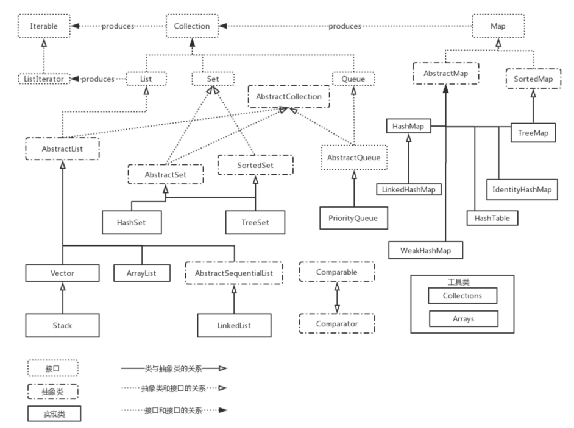
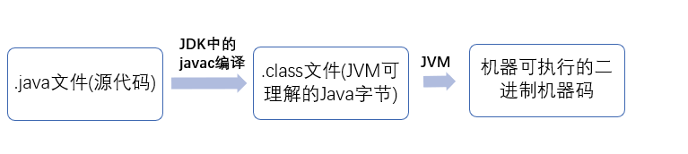

# Java

## 语言特点

- 面向对象（封装，继承，多态）
  - 把构成问题的事务分解成各个对象 
  - 为了描述某个事物在解决整个问题的过程中所发生的行为 
  - 易维护、易复用、易扩展。可以设计出低耦合的系统。 但是性能上来说，比面向过程要低 
- Java 虚拟机实现平台无关性
- Java 语言提供了多线程支持
- Java 语言诞生本身就是为简化网络编程设计的，因此 Java 语言不仅支持网络编程而且很方便

## JDK 和 JRE


- JRE 是 Java 运行时环境。它是运行已编译 Java 程序所需的所有内容的集合，包括 Java 虚拟机（JVM），Java 类库，java 命令和其他的一些基础构件。但是不能用于创建新程序。
- JDK 是 Java Development Kit，它除拥有 JRE 所拥有的一切外，还有编译器（javac）和工具（如 javadoc 和 jdb）。它能够创建和编译程序。
- javac 命令用来编译程序，java 命令用来执行程序
- `Java源代码---->编译器---->jvm可执行的Java字节码(即虚拟指令)---->jvm---->`

- OpenJDK 是一个参考模型并且是完全开源的，而 Oracle JDK 是 OpenJDK 的一个实现，并不是完全开源的
- Oracle JDK 比 OpenJDK 更稳定

## 数据类型

byte：8位，最大存储数据量是255，存放的数据范围是-128~127之间。

short：16位，最大数据存储量是65536，数据范围是-32768~32767之间。

int：32位，最大数据存储容量是2的32次方减1，数据范围是负的2的31次方到正的2的31次方减1。

long：64位，最大数据存储容量是2的64次方减1，数据范围为负的2的63次方到正的2的63次方减1。

float：32位，数据范围在3.4e-45~1.4e38，直接赋值时必须在数字后加上f或F。

double：64位，数据范围在4.9e-324~1.8e308，赋值时可以加d或D也可以不加。

boolean：只有true和false两个取值。

char：16位，存储Unicode码，用单引号赋值。

## 类 Class

### 基本点

- static 静态方法不依赖于任何对象，没有 this 关键字

- 初始化顺序

  静态属性初始化、静态方法块初始化、普通属性初始化、普通方法块初始化、构造函数初始化

- 静态变量也叫类变量，它属于一个类，而不是这个类的对象

- 静态变量将会存储在 Java 虚拟机中一个名叫“Metaspace”（元空间，Java 8 之后）的特定池中

- Math 类的几乎所有方法都是静态的，可以直接通过类名来调用，不需要创建类的对象

- final 类不能被继承，final 方法不能被重写(override)

- 重载就是同一个类中多个同名方法根据不同的传参来执行不同的逻辑处理

- 重写就是子类对父类方法的重新改造，外部样子不能改变，内部逻辑可以改变

- 子类可以继承父类的非 private 成员变量、非 private 方法

- is-a 是继承的一个明显特征，就是说子类的对象引用类型可以是一个父类类型

- 内部类：成员内部类、局部内部类、匿名内部类

- 枚举也是类

### 接口和抽象类

- interface 接口是⼀个完全抽象的类，他不会提供任何方法的实现，只是会进行方法的定义 

- default 方法就是为实现该接口而不覆盖该方法的类提供默认实现的

- 实现接口的类需要提供方法的实现，实现接口使用 implements 关键字来表示，⼀个接口可以有多个实现

- 接口中的变量会被隐式地指定为`public static final`变量（并且只能是`public static final`变量，用`private`修饰会报错），而方法会被隐式地指定为`public abstract`方法且只能是`public abstract`方法

- 接口中不能有 public 和 protected 修饰的方法，抽象类中可以有

- 从设计层面来说，抽象是对类的抽象，是一种模板设计，而接口是对行为的抽象，是一种行为的规范

- 抽象类不能被实例化，但可以有子类，子类必须实现抽象方法

- 需要定义一个类去实现接口，然后再实例化

- 1）语法层面上

  - 接口中不能有 public 和 protected 修饰的方法，抽象类中可以有。
  - 接口中的变量只能是隐式的常量，抽象类中可以有任意类型的变量。
  - 一个类只能继承一个抽象类，但却可以实现多个接口。

  2）设计层面上

  - 抽象类是对类的一种抽象，继承抽象类的类和抽象类本身是一种 `is-a` 的关系。

  - 接口是对类的某种行为的一种抽象，接口和类之间并没有很强的关联关系，所有的类都可以实现 `Serializable` 接口，从而具有序列化的功能。

## 集合



### Collection

- `int size()`; `boolean isEmpty()`; `boolean contains(Object obj)`; `boolean remove(Object obj)` 
- `boolean add(Object element)` 如果由于这个调用改变了集合，返回 `true` 
- `Object[] toArray()`; `<T> T[] toArray(T[] arrayToFill)` 

#### List

- `Arraylist`： `Object[]`数组
- `Vector`：`Object[]`数组
- `LinkedList`： 双向链表(JDK1.6 之前为循环链表，JDK1.7 取消了循环)

#### Set

- `HashSet`（无序）: 基于 `HashMap` 实现的，线程不安全的，可以存储 null 值
- `LinkedHashSet`（有序）：`LinkedHashSet` 是 `HashSet` 的子类，通过 `LinkedHashMap` 来实现的
- `TreeSet`（有序）： 红黑树(自平衡的排序二叉树)

#### Map

- `HashMap`： JDK1.8 之前 HashMap 由数组+链表组成的，数组是 HashMap 的主体，链表则是主要为了解决哈希冲突而存在的（“拉链法”解决冲突）。JDK1.8 以后在解决哈希冲突时有了较大的变化，当链表长度大于阈值（默认为 8）（将链表转换成红黑树前会判断，如果当前数组的长度小于 64，那么会选择先进行数组扩容，而不是转换为红黑树）时，将链表转化为红黑树，以减少搜索时间
- `LinkedHashMap`： `LinkedHashMap` 继承自 `HashMap`，所以它的底层仍然是基于拉链式散列结构即由数组和链表或红黑树组成。另外，`LinkedHashMap` 在上面结构的基础上，增加了一条双向链表，使得上面的结构可以保持键值对的插入顺序。同时通过对链表进行相应的操作，实现了访问顺序相关逻辑。
- `Hashtable`： 是线程安全的
- `TreeMap`： 红黑树（自平衡的排序二叉树）


#### List - Array - ArrayList - LinkedList - Vector

##### List 与 ArrayList

- List 是一个接口，而 ArrayList 是 List 接口的一个实现类

- `List list = new ArrayList();` 

  这句创建了一个 ArrayList 实现类的对象，后把它上溯到了 List 接口，实现了泛型。此时它就是一个 List 对象了，它不能使用 ArrayList 类具有的但是 List 接口没有的属性和方法。 

- `ArrayList list = new ArrayList();` 创建的对象则保留了 ArrayList 的所有属性和方法

- 如果我们创建的是抽象类的对象引用，那么这个对象只能调用自己的非抽象方法，不能调用继承它的子类的独有的方法

- 接口的扩展性好

##### Array 与 ArrayList

- ArrayList 可自动扩容，Array 大小固定
- Array 数组在存放的时候一定是同种类型的元素；ArrayList 不一定
- ArrayList 提供了更多的方法和特性，但效率低
- 不指定数据类型时，ArrayList 会把所有插入其中的数据都当作为object类型来处理，在使用的时候，需要将它们转化为对应的原类型来处理，这就存在了装箱与拆箱的操作，会带来很大的性能损耗。

##### ArrayList、LinkedList、Vector

- ArrayList 和 Vector 是基于数组实现的，LinkedList 是基于双向链表实现的
- ArrayList 和 LinkedList 是线程不安全的，Vector 是线程安全的
- ArrayList 扩容后的容量是之前的1.5倍，Vector 默认情况下扩容后的容量是之前的2倍

### Collections 工具类

https://gitee.com/SnailClimb/JavaGuide/blob/master/docs/java/basic/Arrays,CollectionsCommonMethods.md

```java
void reverse(List list)//反转
void shuffle(List list)//随机排序
void sort(List list)//按自然排序的升序排序
void sort(List list, Comparator c)//定制排序，由Comparator控制排序逻辑
void swap(List list, int i , int j)//交换两个索引位置的元素
void rotate(List list, int distance)//旋转。当distance为正数时，将list后distance个元素整体移到前面。当distance为负数时，将 list的前distance个元素整体移到后面

int binarySearch(List list, Object key)//对List进行二分查找，返回索引，注意List必须是有序的
int max(Collection coll)//根据元素的自然顺序，返回最大的元素。 类比int min(Collection coll)
int max(Collection coll, Comparator c)//根据定制排序，返回最大元素，排序规则由Comparatator类控制。类比int min(Collection coll, Comparator c)
void fill(List list, Object obj)//用指定的元素代替指定list中的所有元素。
int frequency(Collection c, Object o)//统计元素出现次数
int indexOfSubList(List list, List target)//统计target在list中第一次出现的索引，找不到则返回-1，类比int lastIndexOfSubList(List source, list target).
boolean replaceAll(List list, Object oldVal, Object newVal)// 用新元素替换旧元素
```

### 其他

- 使用自然排序，需要实现 Comparable 接口，并且在内部重写 comparaTo 方法；而 Comparator 则是在外部制定排序规则，然后作为排序策略参数传递给某些类
- HashMap 的长度是 2 的幂次方。对数组的长度取模运算，得到的余数用做存放的位置，也就是对应的数组下标。这个数组下标的计算方法是 `(n - 1) & hash`（n 代表数组长度）。
- `Arrays.asList()`传入的对象必须是对象数组，而不是基本类型
- 由于JVM优化，`new String[0]`作为`Collection.toArray()`方法的参数现在使用更好

## 多线程

### [简述线程、程序、进程的基本概念](https://snailclimb.gitee.io/javaguide/#/docs/java/Java基础知识?id=_331-简述线程、程序、进程的基本概念。以及他们之间关系是什么)

- **线程**与进程相似，但线程是一个比进程更小的执行单位。一个进程在其执行的过程中可以产生多个线程。与进程不同的是同类的多个线程共享同一块内存空间和一组系统资源，所以系统在产生一个线程，或是在各个线程之间作切换工作时，负担要比进程小得多，也正因为如此，线程也被称为轻量级进程。
- **程序**是含有指令和数据的文件，被存储在磁盘或其他的数据存储设备中，也就是说程序是静态的代码。
- **进程**是程序的一次执行过程，是系统运行程序的基本单位，因此进程是动态的。系统运行一个程序即是一个进程从创建，运行到消亡的过程。简单来说，一个进程就是一个执行中的程序，它在计算机中一个指令接着一个指令地执行着，同时，每个进程还占有某些系统资源如 CPU 时间，内存空间，文件，输入输出设备的使用权等等。换句话说，当程序在执行时，将会被操作系统载入内存中。 
- 线程是进程划分成的更小的运行单位。线程和进程最大的不同在于基本上各进程是独立的，而各线程则不一定，因为同一进程中的线程极有可能会相互影响。从另一角度来说，进程属于操作系统的范畴，主要是同一段时间内，可以同时执行一个以上的程序，而线程则是在同一程序内几乎同时执行一个以上的程序段。
- 线程作为调度和分配的基本单位，进程作为拥有资源的基本单位

#### Java线程的状态


### 线程池

- 线程池内部维护了若干个线程，没有任务的时候，这些线程都处于等待状态。
- 如果有新任务，就分配一个空闲线程执行。如果所有线程都处于忙碌状态，新任务要么放入队列等待，要么增加一个新线程进行处理。
- 通过 `ThreadPoolExecutor` 的构造函数来创建线程池，然后提交任务给线程池执行就可以了
- JDK 提供的并发容器大部分在 `java.util.concurrent` 包中

#### 优点

- **降低资源消耗**。通过重复利用已创建的线程降低线程创建和销毁造成的消耗。
- **提高响应速度**。当任务到达时，任务可以不需要的等到线程创建就能立即执行。
- **提高线程的可管理性**。线程是稀缺资源，如果无限制的创建，不仅会消耗系统资源，还会降低系统的稳定性，使用线程池可以进行统一的分配，调优和监控。

#### Java多线程的实现

- 继承Thread类，Override它的run方法；
- 实现Runnable接口，实现run方法；
- 实现Callable接口，线程结束后可以有返回值或抛出异常，但是该方式是依赖于线程池的。

### 一些相关方法

#### execute()方法和submit()

- execute()方法用于提交不需要返回值的任务，所以无法判断任务是否被线程池执行成功与否；
- submit()方法用于提交需要返回值的任务

#### sleep() 方法和 wait() 方法

- sleep 方法没有释放锁，而 wait 方法释放了锁
- 两者都可以暂停线程的执行。
- Wait 通常被用于线程间交互/通信，sleep 通常被用于暂停执行。
- wait() 方法被调用后，线程不会自动苏醒，需要别的线程调用同一个对象上的 notify() 或者 notifyAll() 方法。sleep() 方法执行完成后，线程会自动苏醒。或者可以使用 wait(long timeout)超时后线程会自动苏醒。

#### start() 方法、run() 方法

- new 一个 Thread，线程进入了新建状态
- 调用 start() 方法，会启动一个线程并使线程进入了就绪状态，当分配到时间片后就可以开始运行了
- start() 会执行线程的相应准备工作，然后自动执行 run() 方法的内容，这是真正的多线程工作
- 直接执行 run() 方法，会把 run 方法当成一个 main 线程下的普通方法去执行，并不会在某个线程中执行它，所以这并不是多线程工作。

**调用 start 方法方可启动线程并使线程进入就绪状态，而 run 方法只是 thread 的一个普通方法调用，还是在主线程里执行。**

### [悲观锁与乐观锁](https://snailclimb.gitee.io/javaguide/#/docs/essential-content-for-interview/面试必备之乐观锁与悲观锁?id=何谓悲观锁与乐观锁)

#### [悲观锁](https://snailclimb.gitee.io/javaguide/#/docs/essential-content-for-interview/面试必备之乐观锁与悲观锁?id=悲观锁)

- 总是假设最坏的情况，每次去拿数据的时候都认为别人会修改，所以每次在拿数据的时候都会上锁
- 别人想拿这个数据就会阻塞直到它拿到锁（**共享资源每次只给一个线程使用，其它线程阻塞，用完后再把资源转让给其它线程**）
- 传统的关系型数据库里边就用到了很多这种锁机制，比如行锁，表锁等，读锁，写锁等，都是在做操作之前先上锁
- Java中`synchronized`和`ReentrantLock`等独占锁就是悲观锁思想的实现

#### [乐观锁](https://snailclimb.gitee.io/javaguide/#/docs/essential-content-for-interview/面试必备之乐观锁与悲观锁?id=乐观锁)

- 总是假设最好的情况，每次去拿数据的时候都认为别人不会修改，所以不会上锁
- 在更新的时候会判断一下在此期间别人有没有去更新这个数据，可以使用版本号机制和CAS算法实现
- **乐观锁适用于多读的应用类型，这样可以提高吞吐量**，像数据库提供的类似于**write_condition机制**，其实都是提供的乐观锁
- 在Java中`java.util.concurrent.atomic`包下面的原子变量类就是使用了乐观锁的一种实现方式**CAS**实现的

##### 版本号机制

在数据表中加上一个数据版本号version字段，表示数据被修改的次数，当数据被修改时，version值会加一。当线程A要更新数据值时，在读取数据的同时也会读取version值，在提交更新时，若刚才读取到的version值为当前数据库中的version值相等时才更新，否则驳回

##### CAS算法

compare and swap，无锁算法

## [反射](https://blog.csdn.net/sinat_38259539/article/details/71799078)

- JAVA反射机制是在运行状态中，对于任意一个类，都能够知道这个类的所有属性和方法；对于任意一个对象，都能够调用它的任意一个方法和属性；这种动态获取的信息以及动态调用对象的方法的功能称为java语言的反射机制。

- 获取Class对象的三种方式

  ```java
  Student stu1 = new Student();//这一new 产生一个Student对象，一个Class对象。
  Class stuClass = stu1.getClass();//获取Class对象
  Class stuClass2 = Student.class;//第二种方式获取Class对象
  try {
  	Class stuClass3 = Class.forName("fanshe.Student");//第三种方式获取Class对象
  	//注意此字符串必须是真实路径，就是带包名的类路径，包名.类名
  } catch (ClassNotFoundException e) {
      e.printStackTrace();
  }
  ```

- 反射机制，会先拿到某个类的“类对象”，然后通过类对象获取“构造器对象”，再通过构造器对象创建一个对象
- 在运行时判断任意⼀个对象所属的类
  在运行时构造任意⼀个类的对象
  在运行时判断任意⼀个类所有的成员变量和方法
  在运行时调用任意⼀个对象的方法 
- 通过反射可以获得私有方法和属性 

## 注解

注解是一种机制，用于将元标签与程序元素相关联，并允许编译器或虚拟机从这些注解元素中提取程序行为，并在必要时生成相互依赖的代码

### 内置注解

- @Deprecated  给类、方法、变量打上不建议使用的标签
- @Override  标识这个方法重写父类的方法
- @SuppressWarnings  在方法上使用，用于抑制警告
- @SafeVarargs   抑制参数类型安全检查警告
- @FunctionalInterface  用于编译级错误检查，当你写的接口不符合函数式接口定义的时候，编译器会报错

### 元注解

- @Retention  指定注解的生命周期，即存活时间。 在使用时，必须使用下面中的一个值
  - RetentionPolicy.SOURCE  注解只在源码阶段保留，在编译器进行编译生成class文件时丢弃，无法通过反射获取注解信息。
  - RetentionPolicy.CLASS 注解只被保留到编译进行的时候，它并不会被加载到JVM中，无法通过反射获取注解信息，这是默认值。
  - RetentionPolicy.RUNTIME 注解可以保留到程序运行的时候，它会被加载进入到 JVM 中，程序运行时可以通过反射获取到它们
- @Documented  javadoc命令生成的文档中体现注解的内容
- @Target  指定注解可用于哪些元素，例如类、方法、变量等
    - ElementType.ANNOTATION_TYPE 用于描述注解类型 
    - ElementType.CONSTRUCTOR 用于注解构造方法 
    - ElementType.FIELD 用于变量注解 
    - ElementType.LOCAL_VARIABLE 用于局部变量注解 
    - ElementType.METHOD 用于方法注解 
    - ElementType.PACKAGE 用于包注解 
    - ElementType.PARAMETER 用于方法内的参数注解 
- ElementType.TYPE 用于类、接口、枚举注解
- @Inherited  指定了注解可被继承
- @Repeatable  可重复使用的注解

## Java 虚拟机



- JVM直接和操作系统进行交互，与硬件不直接交互，操作系统可以帮我们完成和硬件进行交互的工作
- JVM 可以理解的代码叫做字节码（即扩展名为 `.class` 的文件），它不面向任何特定的处理器，只面向虚拟机
- 字节码并不针对一种特定的机器，因此Java 程序无须重新编译便可在多种不同操作系统的计算机上运行
- 同一个程序，不同平台的 javac 编译后是相同的字节码；JVM 把字节码转换为机器码，因为针对不同系统有特定的实现，所以保证了执行结果相同
- `Java 虚拟机(Java virtual Machines)`：Java虚拟机有自己完善的硬体架构，如处理器、堆栈、寄存器等，还具有相应的指令系统。JVM屏蔽了与具体操作系统平台相关的信息，使得Java程序只需生成在Java虚拟机上运行的目标代码（字节码），就可以在多种平台上不加修改地运行。

### 5个部分


#### 类加载器

如果 **JVM** 想要执行这个 **.class** 文件，我们需要将其装进一个 **类加载器** 中，它就像一个搬运工一样，会把所有的 **.class** 文件全部搬进JVM里面来。

#### 方法区

- 用于存放类似于元数据信息方面的数据的，比如类信息，常量，静态变量，编译后代码···等

- 类加载器将 .class 文件搬过来就是先丢到这一块上

- ```java
  String str1 = "abcd";//先检查字符串常量池中有没有"abcd"，如果字符串常量池中没有，则创建一个，然后 str1 指向字符串常量池中的对象，如果有，则直接将 str1 指向"abcd""；
  String str2 = new String("abcd");//堆中创建一个新的对象
  String str3 = new String("abcd");//堆中创建一个新的对象
  System.out.println(str1==str2);//false
  System.out.println(str2==str3);//false
  ```


#### 堆

**堆** 主要放了一些存储的数据，比如对象实例，数组···等，它和方法区都同属于 **线程共享区域** 。也就是说它们都是 **线程不安全** 的

Java 堆还可以细分为：新生代(Young Generation)、老生代(Old Generation)、永生代(Permanent Generation)

#### 栈

**栈** 这是我们的代码运行空间。我们编写的每一个方法都会放到 **栈** 里面运行

Java 虚拟机栈是由一个个栈帧组成，而每个栈帧中都拥有：局部变量表、操作数栈、动态链接、方法出口信息。

虚拟机栈为虚拟机执行 Java 方法 （也就是字节码）服务，而本地方法栈则为虚拟机使用到的 Native 方法服务

#### 程序计数器

- 主要就是完成一个加载工作，类似于一个指针一样的，指向下一行我们需要执行的代码。
- 和栈一样，都是 **线程独享** 的，就是说每一个线程都会有自己对应的一块区域而不会存在并发和多线程的问题

虚拟机主要的5大块：方法区，堆都为线程共享区域，有线程安全问题，栈和本地方法栈和计数器都是独享区域，不存在线程安全问题，而 JVM 的调优主要就是围绕堆，栈两大块进行

### 垃圾回收

#### 对象是否存活

##### 引用计数法

- 这是一种非常简单易理解的回收算法。每当有一个地方引用一个对象的时候则在引用计数器上 +1，当失效的时候就 -1，无论什么时候计数器为 0 的时候则认为该对象死亡可以回收了。

- 这种算法虽然简单高效，但是却无法解决循环引用的问题，因此 Java 虚拟机并没有采用这种算法。

##### 可达性分析算法

- 主流的语言其实都是采用可达性分析算法:

- 可达性算法是通过一个称为 GC Roots 的对象向下搜索，整个搜索路径就称为引用链，当一个对象到 GC Roots 没有任何引用链，JVM 就认为该对象是可以被回收的。

- Java 的自动内存管理主要是针对对象内存的回收和对象内存的分配
- Java 自动内存管理最核心的功能是 **堆** 内存中对象的分配与回收

#### 标记和扫描算法

为了确定哪些对象不再被使用，JVM会间歇性地运行

- 该算法遍历所有对象引用，从GC根开始，并标记每个找到的对象。
- 所有未被标记对象占用的堆内存都将被回收。它被简单地标记为空闲的，基本上没有未使用的对象。
- 如果有任何对象无法从GC根访问（即使它是自引用的或循环引用的），它将受到垃圾回收。
- 标记清除后会产生大量不连续的碎片

#### 复制算法

为了解决标记和扫描算法的效率问题，将内存分为大小相同的两块，每次使用其中的一块。当这一块的内存使用完后，就将还存活的对象复制到另一块去，然后再把使用的空间一次清理掉。这样就使每次的内存回收都是对内存区间的一半进行回收。

#### 标记-整理算法

标记过程仍然与“标记-清除”算法一样，但后续步骤不是直接对可回收对象回收，而是让所有存活的对象向一端移动，然后直接清理掉端边界以外的内存。


#### 分代收集算法

当前虚拟机的垃圾收集都采用分代收集算法，这种算法没有什么新的思想，只是根据对象存活周期的不同将内存分为几块。一般将 java 堆分为新生代和老年代，这样我们就可以根据各个年代的特点选择合适的垃圾收集算法。

在新生代中，每次收集都会有大量对象死去，所以可以选择复制算法，只需要付出少量对象的复制成本就可以完成每次垃圾收集。

老年代的对象存活几率是比较高的，而且没有额外的空间对它进行分配担保，所以选择“标记-清除”或“标记-整理”算法进行垃圾收集。

## 缓存

### 缓存穿透

查询数据库中不存在的值，缓存里存的都是有值的，故而失去作用。以下两种方式解决

#### 缓存空对象

#### 布隆过滤器 BloomFilter

- 会误判
- 类似于 ArrayList()，但无 get()、delete() 方法
- 占用内存小


- 底层为位数组，不保存真实数据
- 对真实数据进行若干次 hash 运算，再对数组长度取余，对应的位 置1
- 若几个位的值均为1，则该值可能存在；若有一个不为1，则绝对不存在
- 可自定义 hash 函数
- 通过预计插入数据的个数和容错率，可计算出需要的 hash 函数数量和数组长度

### 缓存击穿

并发查询一条数据库有但是缓存没有的数据

- 可能原因：没有访问过、数据过期
- 若是热点数据，并发数量过高，可能造成数据库崩溃
- 互斥锁避免该情况，查询数据前加锁，查询完解锁；锁竞争

### 缓存雪崩

redis宕机、大部分数据失效

- redis高可用集群（cluster）
- 错开数据过期时间
- 熔断、限流

### redis

- string 类型的 value 值是用位数组保存其二进制值的
- setbit 自动扩容
- 5.0之前5种数据类型，之后6种

## 杂项

### Lambda 表达式

`( parameter-list ) -> { expression-or-statements }` 

- `()` 中的 `parameter-list` 是以逗号分隔的参数；
- `->` 相当于 Lambda 的标识符；
- `{}` 中的 `expression-or-statements` 为 Lambda 的主体，可以是一行语句，也可以多行，可包含 `return` 语句

### 其他

- 注解是不支持继承的 
- Deque可以由ArrayDeuqe或者LinkedList实现，它们两者使用的区别以及优劣也就是数组和链表的区别
- null 是所有引⽤类型的默认值 
- 可以使用 == 或者 != 操作来比较 null 值 
- hashCode() 定义在 JDK 的 Object.java 中，这就意味着 Java 中的任何类都包含有 hashCode() 函数。
- 使用默认的 equals() 方法，等价于 == 方法（== 比较地址）
- `==` 运算符比较的时候，如果两个对象都为 null，并不会发生 `NullPointerException`，而 `equals()` 方法则会。`==` 运算符会在编译时进行检查，如果两侧的类型不匹配，会提示错误，而 `equals()` 方法则不会。
- 装箱就是自动将基本数据类型转换为包装器类型，让基本类型具备对象的特征，扩大了基本类型所具有的操作
- 当使用自动装箱方式创建一个Integer对象时，当数值在-128 ~127时，会将创建的 Integer 对象缓存起来，当下次再出现该数值时，直接从缓存中取出对应的Integer对象。
- 在HashSet, Hashtable, HashMap等等这些本质是散列表的数据结构中，若要判断两个对象是否相等，除了要覆盖equals()之外，也要覆盖hashCode()函数；hashset里是根据hashcode来判断元素是不是相同的
- Comparable 和 Comparator 两者之间的区别
  - 一个类实现了 Comparable 接口，意味着该类的对象可以直接进行比较（排序），但比较（排序）的方式只有一种，很单一。
  - 一个类如果想要保持原样，又需要进行不同方式的比较（排序），就可以定制比较器（实现 Comparator 接口）。
  - Comparable 接口在 `java.lang` 包下，而 `Comparator` 接口在 `java.util` 包下
  - 如果对象的排序需要基于自然顺序，请选择 `Comparable`，如果需要按照对象的不同属性进行排序，请选择 `Comparator` 
- Java 程序设计语言总是采用按值调用
- String是只读字符串，它并不是基本数据类型，而是一个对象。从底层源码来看是一个final类型的字符数组
- String 类要设计成 final 的呢？原因大致有以下三个：
  - 为了实现字符串常量池
  - 为了线程安全
  - 为了 HashCode 的不可变性
- Vector是线程安全的，ArrayList不是线程安全的。ArrayList在底层数组不够用时在原来的基础上扩展0.5倍，Vector是扩展1倍
- 枚举默认实现了 Serializable 接口，因此 Java 虚拟机可以保证该类为单例
- Object的equals方法容易抛空指针异常，应使用常量或确定有值的对象来调用 equals
- 当使用自动装箱方式创建一个Integer对象时，当数值在-128 ~127时，会将创建的 Integer 对象缓存起来，当下次再出现该数值时，直接从缓存中取出对应的Integer对象。
- `synchronized` 关键字是解决并发问题常用解决方案
  - 同步普通方法，锁的是当前对象。
  - 同步静态方法，锁的是当前 `Class` 对象。
  - 同步块，锁的是 `()` 中的对象。

## 参考

- [Java hashCode() 和 equals()的若干问题解答](https://www.cnblogs.com/skywang12345/p/3324958.html)
- https://snailclimb.gitee.io/javaguide/#/?id=java
- 