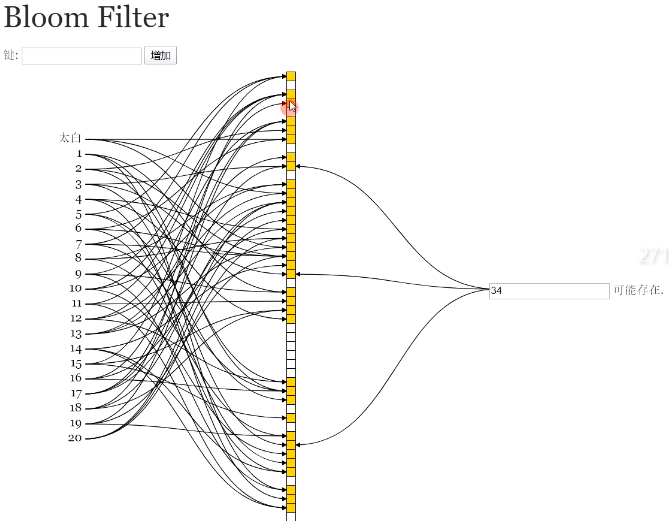

## 缓存穿透

查询数据库中不存在的值，缓存里存的都是有值的，故而失去作用。以下两种方式解决

### 缓存空对象

### 布隆过滤器 BloomFilter

- 会误判
- 类似于 ArrayList()，但无 get()、delete() 方法
- 占用内存小

#### 底层原理

- 底层为位数组，不保存真实数据
- 对真实数据进行若干次 hash 运算，再对数组长度取余，对应的位 置1
- 若几个位的值均为1，则该值可能存在；若有一个不为1，则绝对不存在
- 可自定义 hash 函数
- 通过预计插入数据的个数和容错率，可计算出需要的 hash 函数数量和数组长度

## 缓存击穿

并发查询一条数据库有但是缓存没有的数据

- 可能原因：没有访问过、数据过期
- 若是热点数据，并发数量过高，可能造成数据库崩溃
- 互斥锁避免该情况，查询数据前加锁，查询完解锁；锁竞争

## 缓存雪崩

redis宕机、大部分数据失效

- redis高可用集群（cluster）
- 错开数据过期时间
- 熔断、限流

## redis

- string 类型的 value 值是用位数组保存其二进制值的
- setbit 自动扩容
- 5.0之前5种数据类型，之后6种
- 

