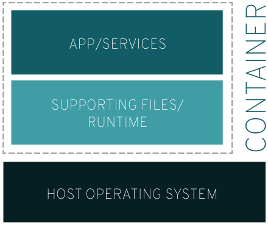
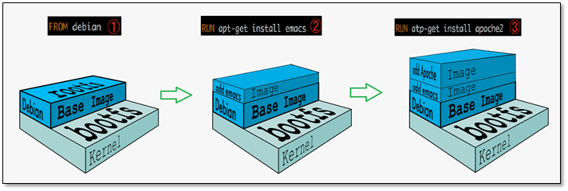
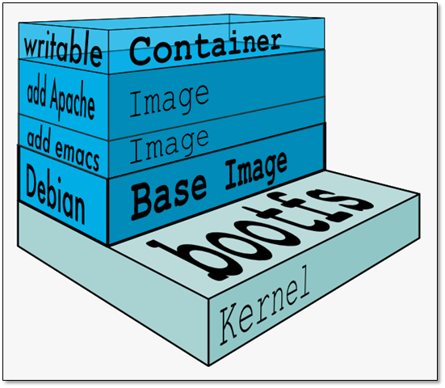

# Docker 的简单使用

## Linux 容器



- Linux容器是与系统其他部分隔离开的一系列进程

- 容器包含了应用的所有依赖项，因而在从开发到测试再到生产的整个过程中，它都具有可移植性和一致性

- 虚拟化使得许多操作系统可同时在单个系统上运行。容器则可共享同一个操作系统内核，将应用进程与系统其他部分隔离开

  

## Docker


- 借助 Docker ，可将容器当做重量轻、模块化的虚拟机使用。同时还将获得高度的灵活性，从而实现对容器的高效创建、部署及复制，并能将其从一个环境顺利迁移至另一个环境。
- Docker 技术使用 Linux 内核和内核功能（例如 Cgroups 和 namespaces）来分隔进程，以便各进程相互独立运行。

### 基本命令

- docker version

- 配置docker镜像加速

  ```bash
  vi /etc/docker/daemon.json
  {
    "registry-mirrors": ["https://registry.docker-cn.com"]
  }
  ```

- docker image rm centos:latest    删除镜像

- docker ps    查看正在运行的镜像

### Dockerfile

- docker image build  -t centos6.8-ssh .
  -t 为镜像标签打标签  . 表示当前路径
- https://github.com/CentOS/CentOS-Dockerfiles

### 镜像分层



- 从 base 镜像一层一层叠加生成的。每安装一个软件，就在现有镜像的基础上增加一层。
- 有多个镜像都从相同的 base 镜像构建而来，那么 Docker Host 只需在磁盘上保存一份 base 镜像；同时内存中也只需加载一份 base 镜像，就可以为所有容器服务了。而且镜像的每一层都可以被共享。
- 当某个容器修改了基础镜像的内容，这时其他容器的 /etc 是不会被修改的，修改只会被限制在单个容器内。

#### 可写的容器层



- 当容器启动时，一个新的可写层被加载到镜像的顶部。这一层通常被称作“容器层”，“容器层”之下的都叫“镜像层”。
- 所有对容器的改动 - 无论添加、删除、还是修改文件都只会发生在容器层中。
- 只有容器层是可写的，容器层下面的所有镜像层都是只读的。

#### 文件操作


- 只有当需要修改时才复制一份数据，这种特性被称作 Copy-on-Write
- 容器层记录对镜像的修改，所有镜像层都是只读的，不会被容器修改，所以镜像可以被多个容器共享

## 参考

- [Docker 入门看这一篇就够了，万字详解！](https://mp.weixin.qq.com/s?__biz=MzU2NDg0OTgyMA==&mid=2247487184&idx=1&sn=9dd53dbe693e9c6a2166d1f1bee3c792&chksm=fc45f323cb327a35d684095e1db3e90e3cd0663fd1a13641aaf2f4d45ac4991b2af4d0c8a4db&mpshare=1&scene=1&srcid=&sharer_sharetime=1590206039689&sharer_shareid=0371ca963acf0af2ddb31b55f8b68241#rd)
- https://docs.docker.com/engine/install/ubuntu/
- https://www.cnblogs.com/clsn/p/8410309.html
