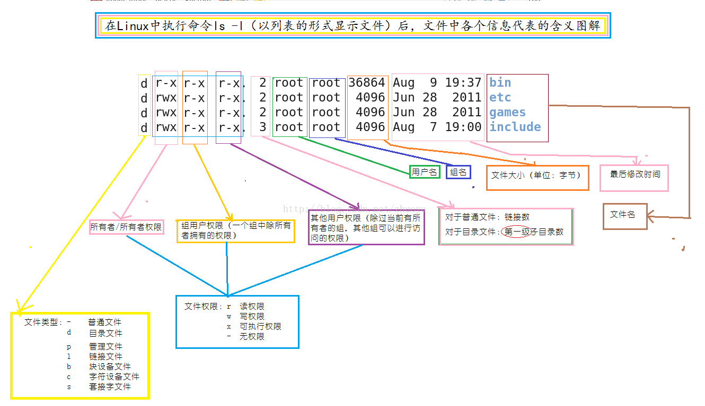

# 文件权限

## 创建文件

`mkdir [-p] DirName` 创建文件夹（可多层）

- `echo "this is a new file" > file3.txt` 覆盖
- `echo "add contents" >> file3.txt` 追加
- `touch test.txt` 
- `vi file.txt` 直接创建并打开文件
- `cd > file2.txt` 创建新的空文件

## 查看文件属性

`ls -l` list (use a long listing format)

- `[权限][连结][拥有者][群组][文件容量][修改日期][档名]` 
- 一般文件(-)与目录文件(d)
- 

## 改变文件属性

### `chgrp` change group

改变所属组

- `chgrp [-R] groupname dirname/filename` 
- 群组需在 `/etc/group` 中

### `chown` change owner

改变文件的所有者

- `chown [-R] username:groupname dirname/filename` （`:`也可以用`.`代替）
- 帐号需在 `/etc/passwd` 有记录
- `chown .groupname dirname/filename ` 可以修改群组

### `chmod` change mode

  用于控制用户对文件的权限的命令，只有文件所有者和超级用户可以修改文件或目录的权限

```bash
  chmod [可选项] <mode> <file...>
  
  [可选项]
    -R, --recursive        change files and directories recursively （以递归的方式对目前目录下的所有档案与子目录进行相同的权限变更)
  
  [mode] 
      权限设定字串，详细格式如下 ：
      [ugoa...][[+-=][rwxX]...][,...]，
   
      其中
      [ugoa...]
      u 表示该档案的拥有者，g 表示与该档案的拥有者属于同一个群体(group)者，o 表示其他以外的人，a 表示所有（包含上面三者）。
      [+-=]
      + 表示增加权限，- 表示取消权限，= 表示唯一设定权限。
      [rwxX]
      r 表示可读取，w 表示可写入，x 表示可执行，X 表示只有当该档案是个子目录或者该档案已经被设定过为可执行。
   	
  [file...]
      文件列表（单个或者多个文件、文件夹）
```

- `chmod a+r,ug+w,o-w a.conf b.xml`  

  设置文件 `a.conf` 与 `b.xml` 权限为拥有者与其所属同一个群组可读写，其它组可读不可写

- `chmod -R a+rw *` 

  设置当前目录下的所有文件与子目录皆设为任何人可读写

- 目录的`x`代表的是用户能否进入该目录成为工作目录的用途

## 参考

- <https://explainshell.com/>
- <http://cn.linux.vbird.org/linux_basic/0210filepermission.php>
- <https://www.cnblogs.com/huchong/p/9075201.html>
- <https://www.jianshu.com/p/5c506fc3513c>
- <http://cn.linux.vbird.org/linux_basic/0210filepermission_2.php>